# ML-DSA & ML-ADSA — Visual Walkthrough, End-to-End, with Security & Side-Channel Guarantees

This document is the **picture book** for the corpus: every step of **ML-DSA** (FIPS-204) and of
**ML-ADSA** (the aggregate construction) drawn as a diagram, end-to-end, together with **what guarantees
each step's security** and **how each step is kept free of side-channels / secret leaks**. It is a
navigation layer over the authoritative text — the formal spec (`docs/30`), the verification dossier
(`docs/31`), the optimization / constant-time posture (`docs/34`), and the research paper (`paper/`).

The diagrams are [Mermaid](https://mermaid.js.org/) — they render natively on GitHub and on the docs site,
and the source is plain text (auditable, deterministic, no binary assets).

---

## 0. How to read these diagrams

Every value is colored by its **secrecy class**, because the side-channel story is exactly "which wires
carry secrets, and is every gate that touches them data-independent?"

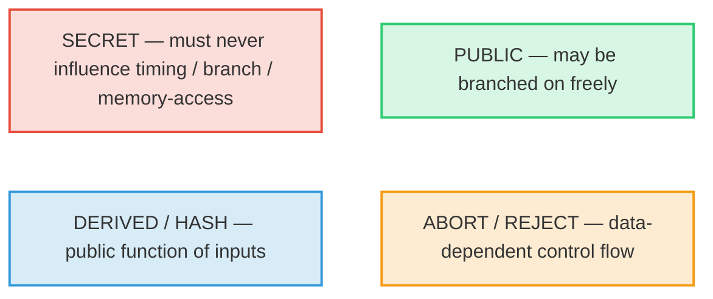

- **Red = secret.** The whole constant-time argument is: every operation on a red wire is straight-line
  and branchless (§5).
- **Green = public.** Anything an adversary already knows; branching on it is free.
- **Blue = derived/hash.** A deterministic public function (SHAKE, encode, NTT of a public value).
- **Amber = a data-dependent branch** — flagged explicitly so the residual control-flow surface is visible
  rather than hidden.

The class is carried by a **colored border + a translucent tint**, and the box/text colors follow the page
theme — so the diagrams stay legible in both light and dark mode (and on GitHub).

> **Two levels of detail (nothing is hidden).** The top-of-section flowcharts give the *shape* of each
> algorithm; the **finer detail is then drawn out explicitly** for academic readers — the
> domain-separation tags in seed/XOF expansion (§2.1.1), the **NTT-domain arithmetic** behind every
> polynomial product (§1 and §2.1.2), and the **`pkEncode`/`skEncode`/`sigEncode` byte layouts** (§2.1.3) —
> with a FIPS-204-step ↔ diagram ↔ Go-symbol traceability map in §2.4. The byte-exact authoritative
> procedure remains the formal specification (`docs/30`) and the reference code; this section reproduces the
> load-bearing low-level structure rather than abstracting it away.

Each diagram is followed by **🔒 Security** (what makes the step sound) and **🛡 Side-channel** (how the step
avoids leaking), with pointers to the Go symbol and the proof artifact.

---

## A primer for new readers — notation & the key operations

New to lattice signatures? Read this first; every later diagram reuses these symbols and operations. Each
operation is broken out three ways: **Math** (the formula), **Compute** (what the code does), and **Picture**
(the intuition). The site renders math with MathJax; on GitHub the same `$…$` shows inline.

### Notation key

| Symbol | Name | Plain meaning |
|---|---|---|
| $q = 8380417$ | the modulus | a prime; all coefficients live in $\{0,\dots,q-1\}$ ($q = 2^{23}-2^{13}+1$) |
| $n = 256$ | ring degree | every polynomial has 256 coefficients |
| $R_q$ | the ring | polynomials of degree $<256$, coefficients mod $q$, reduced mod $X^{256}+1$ |
| $k,\ell$ | matrix shape | $A$ is $k\times\ell$ over $R_q$ (e.g. $8\times7$ for -87) |
| $A$ | public matrix | random, expanded from the seed $\rho$ |
| $s_1,s_2$ | secret key | **small** polynomials ($\lVert\cdot\rVert_\infty\le\eta$) |
| $t = As_1+s_2$ | public key core | a Module-LWE sample (hides $s_1,s_2$) |
| $t_1,t_0$ | hi/lo of $t$ | $t_1$ public (in `pk`), $t_0$ secret (in `sk`) |
| $y$ | masking nonce | random, $\lVert y\rVert_\infty<\gamma_1$ |
| $w = Ay$ | commitment | the "first move" of the proof |
| $w_1$ | high bits of $w$ | what the verifier reconstructs |
| $c$ | challenge | sparse $\pm1$ polynomial, $\tau$ nonzeros |
| $\tilde c$ | challenge hash | the seed that defines $c$ (stored in $\sigma$) |
| $z = y + c\,s_1$ | response | the "answer"; must be leak-free |
| $h$ | hint | tiny carry-correction bits |
| $\mu$ | message rep. | $H(H(pk)\,\Vert\,ctx\,\Vert\,m)$ |
| $\eta,\tau,\gamma_1,\gamma_2,\beta,\omega$ | bounds | secret size, challenge weight, mask range, rounding, $\beta=\tau\eta$, max hint weight |
| $\hat{x}$ | NTT of $x$ | $x$ transformed into the NTT domain |
| $\odot$ | pointwise mult. | coefficient-wise multiply in the NTT domain |
| $\lVert x\rVert_\infty$ | infinity norm | the largest coefficient magnitude (centered) |

### The ring $R_q$ — where everything lives

> **Math.** $R_q = \mathbb{Z}_q[X]/(X^{256}+1)$. An element is $a_0 + a_1X + \dots + a_{255}X^{255}$ with each
> $a_i \in \{0,\dots,q-1\}$. Multiplication wraps around using $X^{256} = -1$.
> **Compute.** A polynomial is just an array of 256 integers (`[]int64` in the code). Add = add the arrays
> mod $q$; multiply = polynomial convolution then reduce mod $X^{256}+1$ and mod $q$.
> **Picture.** A clock with $q$ ticks for each of 256 slots; arithmetic that overflows wraps around the
> clock, and the $X^{256}=-1$ rule folds the top half back with a sign flip.

### NTT / INTT — fast multiplication

> **Math.** Because $q\equiv1 \pmod{512}$, $X^{256}+1$ factors into 256 linear pieces, so a polynomial is
> determined by its values at the 256 roots. The NTT is that evaluation; it turns convolution into
> coordinate-wise product: $\widehat{f\cdot g} = \hat f \odot \hat g$, and $\mathrm{INTT}(\hat f)=f$.
> **Compute.** An in-place network of "butterflies" (§1), $O(n\log n)$ instead of $O(n^2)$. Multiply two
> polynomials by `NTT → ⊙ → INTT`.
> **Picture.** Like the FFT: hard work (convolution) becomes easy (elementwise multiply) after a change of
> coordinates, then you transform back.

### Module-LWE — why $t = As_1+s_2$ is safe to publish

> **Math.** Given random $A$ and $t = As_1+s_2$ with **small** $s_1,s_2$, recovering $(s_1,s_2)$ is the
> Module-LWE problem; distinguishing $t$ from uniform is its decision form. Both are believed hard even for
> quantum computers (NIST Category 2/3/5 for -44/-65/-87).
> **Compute.** One matrix–vector product in the NTT domain plus a small-noise add (§2.1.2).
> **Picture.** A linear system $As_1=t$ that has been *fuzzed* by a little noise $s_2$: you can see $A$ and
> $t$, but the fuzz hides the exact solution.

### Decompose / HighBits / LowBits — coarse + fine split

> **Math.** With $\alpha = 2\gamma_2$, write $r = r_1\alpha + r_0$ where $r_0\in(-\alpha/2,\,\alpha/2]$. Then
> $\mathrm{HighBits}(r)=r_1$, $\mathrm{LowBits}(r)=r_0$.
> **Compute.** Round $r$ to the nearest multiple of $\alpha$ (that index is $r_1$) and keep the remainder
> $r_0$ (`decomposeP`).
> **Picture.** Reading a ruler: the big tick you're nearest to ($r_1$) plus the small offset from it ($r_0$).

### Power2Round — split off the low bits of the key

> **Math.** $r = r_1\,2^d + r_0$ with $d=13$, $r_0\in(-2^{d-1},2^{d-1}]$. For the key: $t_1$ (high, public),
> $t_0$ (low, secret).
> **Compute.** Bit-shift: $t_1$ is "$t$ with its low 13 bits dropped", $t_0$ is those low bits centered
> (`power2round`).
> **Picture.** Splitting a price into "dollars" ($t_1$, shown publicly) and "cents" ($t_0$, kept private).

### SampleInBall — the challenge $c$

> **Math.** $c\in R_q$ with exactly $\tau$ coefficients equal to $\pm1$ and the rest $0$; so $\lVert
> c\rVert_\infty=1$ and $\lVert c\rVert_1=\tau$.
> **Compute.** Hash $\tilde c$ to a stream, then Fisher–Yates-place $\tau$ signs (`sampleInBallP`).
> **Picture.** A mostly-empty vector with a few $+1/-1$ spikes — small enough that $c\cdot s_1$ stays small.

### Rejection sampling (Fiat–Shamir *with aborts*) — the leak-free trick

> **Math.** Output $z=y+cs_1$ **only if** $\lVert z\rVert_\infty<\gamma_1-\beta$ (and the other bounds);
> otherwise pick a fresh $y$ and retry. This makes the distribution of accepted $z$ **independent of the
> secret** $s_1$.
> **Compute.** A loop that re-draws the nonce until all bound checks pass (the amber loop in §2.2).
> **Picture.** Re-rolling the dice until the result lands in a "safe window" that looks the same no matter
> what the secret is — so the published $z$ tells an attacker nothing about $s_1$.

### MakeHint / UseHint — 1-bit carry corrections

> **Math.** A single bit per coefficient recording whether adding the secret term flips the HighBits value;
> $\mathrm{UseHint}$ then recovers $w_1$ exactly from public data $Az-c\,t_1 2^d$ without knowing $t_0$.
> **Compute.** `makeHintP` sets the bit when $\mathrm{HighBits}$ would differ; `useHint` applies the $\pm1$
> correction. The hint is run-length packed into $\sigma$.
> **Picture.** A margin note saying "carry the 1 here" so the verifier, lacking the secret low bits, still
> arrives at the same rounded value.

### The aggregation idea — sum of responses = response of the summed key

> **Math.** $\displaystyle z^* = \sum_i z_i = \sum_i (y_i + c\,s_{1,i}) = \Big(\sum_i y_i\Big) + c\sum_i
> s_{1,i}$ — exactly the response of *one* signer whose key is $t^*=\sum_i t_i$ and whose nonce is $\sum_i
> y_i$. Everything is **linear**, so it adds.
> **Compute.** Coefficient-wise vector addition of the public contributions (§3.2).
> **Picture.** This is BLS's "multiply the signatures" move, done with **+** in a lattice instead of **×** in
> a pairing group.

### HVZK / "perfect masking" — the signature hides the secret

> **Math.** The accepted $z$ is uniform on its allowed window regardless of $s_1$; equivalently, a simulator
> with no secret can produce identically-distributed signatures. This is the core of the security proof and
> is machine-checked (`reject_uniform`, `masking_perfect_concrete`).
> **Compute.** Guaranteed by the rejection step above; nothing extra at runtime.
> **Picture.** The signature is a "frosted glass" view: provably the same shape whether or not you know the
> secret behind it.

---

## Geometry & spatial intuition (for new readers)

The equations above describe *what* the objects are; these pictures show *where they live and how they move*.
They are monospace sketches (so they read in light or dark, here and on GitHub). Schematic, not to scale.

### The workspace — one polynomial, and the module of them

A single element of $R_q$ is a row of 256 coefficient slots. The matrix `A`, the keys, and the responses are
small grids whose every **cell is one such 256-slot polynomial**:

```
one polynomial in R_q  =  256 slots, each a value in [0, q):

 idx 0    1    2    3              254  255
   ┌────┬────┬────┬────┬─ ... ─┬────┬────┐
   │ a0 │ a1 │ a2 │ a3 │       │a254│a255│      multiply wraps with X²⁵⁶ = −1
   └────┴────┴────┴────┴─ ... ─┴────┴────┘      (top half folds back, sign-flipped)

the module equation  t = A·s1 + s2   (each ▦ is a whole polynomial like the row above):

         s1 (ℓ=7 polys)
          ▦ ▦ ▦ ▦ ▦ ▦ ▦
        ┌───────────────┐   ┌─┐      ┌─┐        ┌─┐
   A →  │ ▦ ▦ ▦ ▦ ▦ ▦ ▦ │ · │▦│  +   │▦│   =    │▦│   ← t  (k=8 polys)
 (8×7)  │ ▦ ▦ ▦ ▦ ▦ ▦ ▦ │   │▦│      │▦│        │▦│
        │   … 8 rows …   │   │⋮│      │⋮│        │⋮│
        └───────────────┘   └─┘      └─┘        └─┘
                          row·s1   + s2(k=8)  =  t
```

### Module-LWE — the security geometry

The columns of `A` span a **lattice** (a regular grid of points). `A·s1` is one lattice point; adding the
tiny noise `s2` nudges `t` *just off* a grid point. Publishing `t` is safe because finding the nearest grid
point (hence `s1,s2`) is the hard lattice problem — even for a quantum computer.

```
 ·      ·      ·      ·      ·        · = lattice point (some A·s1)
 ·      ·      ·      ·      ·
 ·      ·    ·∘ ← A·s1                ∘ = the exact lattice point
 ·      · ╱  •  t = A·s1 + s2         • = t, sitting a hair off ∘
 ·      ·      ·      ·      ·            (offset = small noise s2)
 ·      ·      ·      ·      ·
   given  •  and the grid, find ∘  ⇒  recover the secret   (believed HARD)
```

### Decompose / HighBits / LowBits — a ruler

Each coefficient is read like a ruler: the nearest **big tick** (a multiple of `α = 2γ₂`) is the HighBits,
and the small signed offset to it is the LowBits.

```
 0        α        2α       3α       4α          big ticks = multiples of α
 ├────────┼────────┼────────┼────────┼─ … ─┤
                 r1·α    ↑r
                     └─r0─┘                     r0 = signed distance to nearest tick
 HighBits(r) = r1   (which big tick)            LowBits(r) = r0  (the leftover)
```

### Power2Round — splitting a coefficient's bits

`t` is sawn along a bit boundary: the high bits go public (`t1` in `pk`), the low 13 bits stay secret
(`t0` in `sk`).

```
 bit 22                              bit 13 │ bit 12                 bit 0
 ┌──────────────────────────────────────┐  │  ┌──────────────────────────┐
 │   t1  =  high bits   (PUBLIC, in pk)  │  │  │  t0 = low 13 bits (SECRET)│
 └──────────────────────────────────────┘  │  └──────────────────────────┘
                                t  =  t1·2¹³  +  t0
```

### SampleInBall — the challenge is a sparse sign vector

`c` is mostly zeros with exactly `τ` spikes of `±1`. That sparsity is *why* `c·s1` stays small (it is just
`τ` shifted, signed copies of `s1` summed).

```
 c =  256 slots, exactly τ are ±1, rest 0:
   ┌─┬─┬─┬─┬─┬─┬─┬─┬─┬─┬─┬─┬─ … ─┬─┬─┐
   │0│0│+│0│0│−│0│0│0│+│0│0│     │−│0│      ‖c‖∞ = 1   (each spike is ±1)
   └─┴─┴─┴─┴─┴─┴─┴─┴─┴─┴─┴─┴─ … ─┴─┴─┘      ‖c‖₁ = τ   (count of spikes, 60 for -87)
```

### The "realm of answers" — the accept window (rejection sampling)

The response `z` may only be released if **every** coefficient lands inside a safe window strictly inside the
full mask range. Inside the window, `z` looks identical to a secret-free sample; near the edges it could leak,
so those attempts are thrown away and retried.

```
 −γ1            −(γ1−β)            0            +(γ1−β)            +γ1
  ├───REJECT─────┼══════════════ ACCEPT ══════════════┼─────REJECT───┤
  │  (too large; │   z here is indistinguishable      │  (too large) │
  │  may leak s1)│   from a secret-free distribution  │              │
                 └────────── leak-free zone ──────────┘
 release σ only if  ‖z‖∞ < γ1 − β   (every coordinate in the ═══ window); else resample
```

### Aggregation — adding the answers tip-to-tail

Because every operation is linear, the signers' responses **add** like vectors, and so do their keys — so the
sum verifies under the single summed key. (BLS *multiplies* signatures in a group; ML-ADSA *adds* them in a
lattice — the same idea, dual operation.)

```
   z1 ─────▶
            z2 ───▶
                   z3 ──────▶                  z* = z1 + z2 + z3 + … + zN
   ●─────────────────────────▶  z*             t* = t1 + t2 + … + tN
                                               ⇒  z* verifies under the ONE key t*
```

---

## 1. The shared base layer: the ring `R_q` and the NTT

Both schemes live in `R_q = Z_q[X]/(X²⁵⁶+1)`, `q = 8380417`, `n = 256`. All polynomial multiplication goes
through the **Number-Theoretic Transform** (NTT) — the single hottest operation, and therefore the focus of
both the optimization and the constant-time work.

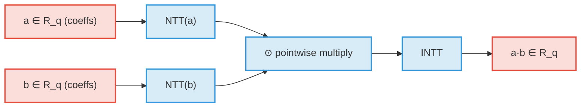

The NTT itself is a fixed network of **Cooley–Tukey butterflies** — the control flow (which indices pair
with which, the loop bounds, the twiddle schedule `ζ = 1753`) depends only on `n = 256`, **never on the
coefficient values**:

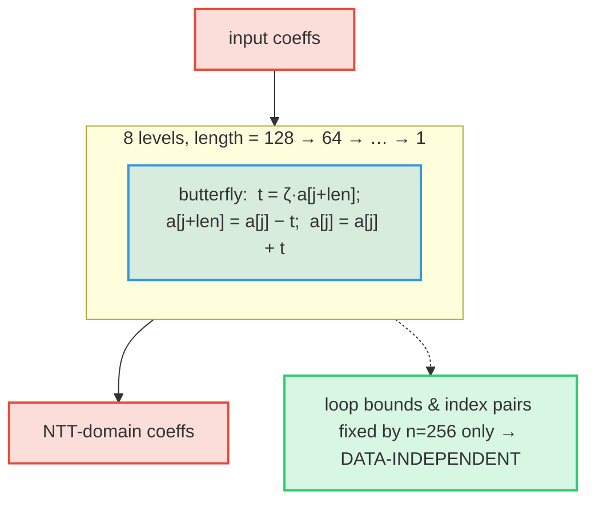

**🔒 Security.** The NTT is a *ring isomorphism* — multiplication via NTT is exact (`NTT(p·q)=NTT(p)⊙NTT(q)`,
`INTT∘NTT=id`). This is machine-checked from first principles (`ct_correct`, `ntt_tree_correct`,
`forest_loop_correct`, and the literal index arithmetic `jloop_eq`/`jloop_forest`), and the Montgomery
reduction constant `q·qinv ≡ 1 (mod 2³²)` is proved (`ml_adsa_montgomery.ec`). See `docs/31` and the paper §1.4.

**🛡 Side-channel.** The butterfly network is **straight-line with data-independent control flow** — this is
the property that makes the NTT constant-time, and it is **machine-backed** (`docs/34 §2a`). The reductions
inside the butterfly are branchless (`modQ` = `r + ((r>>63)&Q)`; the AVX2 kernel uses a Montgomery reduce
with a branchless `2³²−Q` correction, byte-identical to generic — `ntt_amd64.s`, `montgomery.go`). Go
symbols: `nttGeneric`/`inttGeneric` (`mldsa87.go`), `nttAVX2`/`inttAVX2` (`ntt_amd64.go`).

---

## 2. ML-DSA-87 (FIPS-204) end-to-end

### 2.1 KeyGen (Algorithm 1)

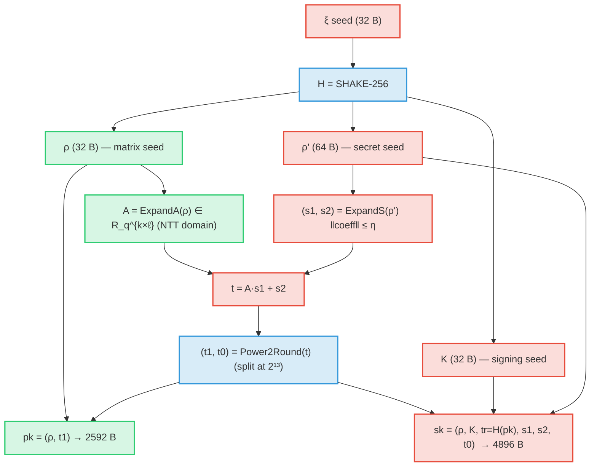

**🔒 Security.** `t = A·s1 + s2` is a **Module-LWE sample**: recovering `(s1,s2)` from `(A,t)` is the MLWE
problem at Category 5. `t1` (the published high bits) leaks nothing usable; `t0` is kept secret in `sk`.
Go: `KeyGenP` (`sign_param.go`). Assumption: decisional MLWE.

**🛡 Side-channel.** `s1,s2` are sampled by rejection from a SHAKE stream (`rejBoundedPolyP`); the *number*
of XOF reads can vary, but it is a function of the **public seed expansion**, not of any pre-existing
secret, and the sampled coefficients never steer a secret-dependent branch downstream. `A·s1+s2` is the
constant-time NTT path of §1.

#### 2.1.1 Finer detail — seed expansion & domain separation

The single seed `ξ` is split by a SHAKE-256 call that is **domain-separated by the parameter set** (the
`k,ℓ` bytes), and every matrix entry / secret polynomial is then derived under a **distinct index tag**, so
no two XOF streams collide:

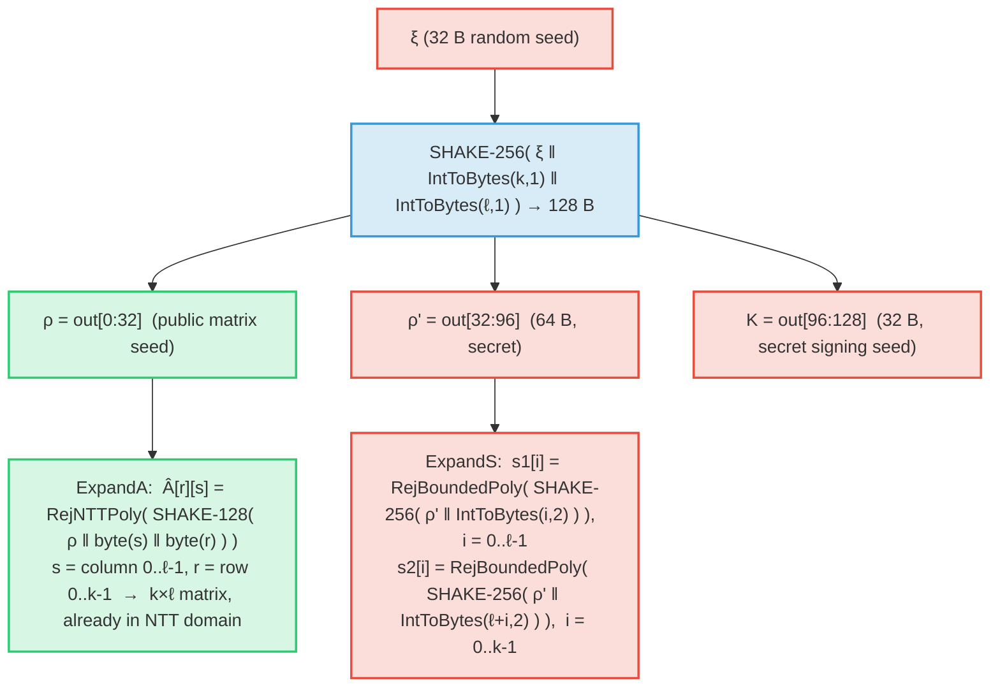

The domain-separation tags: `IntToBytes(k,1)‖IntToBytes(ℓ,1)` separates *parameter sets*; the column/row
bytes `(s,r)` separate the `k·ℓ` matrix polynomials; the 16-bit little-endian nonce `IntToBytes(i,2)`
(running `0..ℓ-1` for `s1`, then `ℓ..ℓ+k-1` for `s2`) separates the `ℓ+k` secret polynomials. Go:
`KeyGenP` → `expandAP`/`ExpandA`, `expandSP`/`rejBoundedPolyP` (the masking nonce reuses the same idea:
`expandMaskP` tags with the 16-bit counter `κ+r`).

#### 2.1.2 Finer detail — the key `t = A·s1 + s2` in the NTT domain

`A` is produced *already in the NTT domain* (`Â`), so the matrix–vector product is a pointwise
multiply-accumulate, with one inverse transform before adding `s2`:

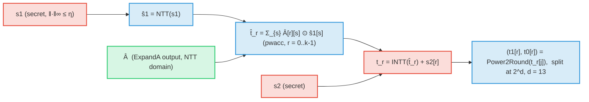

This `NTT → ⊙-accumulate → INTT` pattern (Go `ntt`/`pwacc`/`intt`, §1) is the *same* arithmetic used in Sign
(`A·y`, `c·s1`, `c·s2`, `c·t0`) and Verify (`A·z`, `c·t1·2^d`); it is drawn once here and referenced
elsewhere. `⊙` is coefficient-wise multiply in the NTT domain.

#### 2.1.3 Finer detail — `pkEncode` / `skEncode` byte layout

The keys are bit-packed (LSB-first); the byte offsets below are for **ML-DSA-87** (`k=8, ℓ=7, η=2, d=13`),
with the general formula in each row. `bη = bitlen(2η)` = 3 for `η=2` (-44/-87), 4 for `η=4` (-65).

**`pk` — `pkEncode(ρ, t1)`, total `32 + k·(256·10/8)` = 2592 B:**

| offset | size (B) | field | encoding |
|---|---|---|---|
| 0 | 32 | `ρ` | raw matrix seed |
| 32 | `k·320` (2560) | `t1` | `pack(t1[r], 10 bits)`, `r = 0..k-1` (10 = `bitlen(q-1) − d`) |

**`sk` — `skEncode(ρ, K, tr, s1, s2, t0)`, total `128 + (ℓ+k)·(256·bη/8) + k·(256·13/8)` = 4896 B:**

| offset | size (B) | field | encoding |
|---|---|---|---|
| 0 | 32 | `ρ` | raw |
| 32 | 32 | `K` | raw signing seed |
| 64 | 64 | `tr = H(pk)` | binds `sk` to its `pk` |
| 128 | `ℓ·(256·bη/8)` (672) | `s1` | `pack(η − s1[i], bη bits)` |
| 800 | `k·(256·bη/8)` (768) | `s2` | `pack(η − s2[i], bη bits)` |
| 1568 | `k·(256·13/8)` (3328) | `t0` | `pack(2^(d-1) − t0[i], 13 bits)` |

(The signature `σ` is analogously `sigEncode(c̃, z, h)` = `c̃` ‖ `pack(γ1 − z, 1+bitlen(γ1−1))` ‖
hint-run-length encoding — see §2.2 and §2.4.) Go: `PkEncode`/`pkEncodeP`, `SkDecode` (the codec; encode is
inline in `KeyGenP`), `SigEncode`/`sigEncodeP`, `hintPack`. The derived sizes are asserted against CIRCL in
`params_selfcheck_test.go`.

### 2.2 Sign — Fiat–Shamir **with aborts** (Algorithm 7)

This is the only place with an intentional **data-dependent loop** (the rejection sampler). It is drawn
explicitly:


**🔒 Security.** The accepted `z = y + c·s1` is **perfectly masked**: conditioned on acceptance it is uniform
on its norm window, *independent of the secret shift `c·s1`*. This perfect-HVZK property is the heart of the
EUF-CMA proof and is now **machine-checked from first principles** — the rejection-sampling
change-of-variables `reject_uniform` / `masking_perfect_concrete` (`ml_adsa_masking.ec`), resting only on
`0 ≤ β ≤ γ1−1`. Go: `SignP` (`sign_param.go`).

**🛡 Side-channel.** The four amber checks (`‖z‖`, `‖r0‖`, `‖c·t0‖`, hint weight) **abort the attempt** — the
*number of attempts* is secret-dependent (inherent to FS-with-aborts). Two mitigations:
(1) the magnitude comparisons use the **branchless centered absolute value** `cabs` (a constant-time select,
not a data branch — `mldsa87.go`); (2) ML-ADSA's deployment uses **deterministic nonces** and a combiner
that **abstains on a *public* norm sum** (§3), so the loop-count surface is removed from the aggregate path.
The automated screen for this is the dudect Welch t-test harness (`ct_test.go`, `docs/34 §2c`).

### 2.3 Verify (Algorithm 8) — no secrets at all

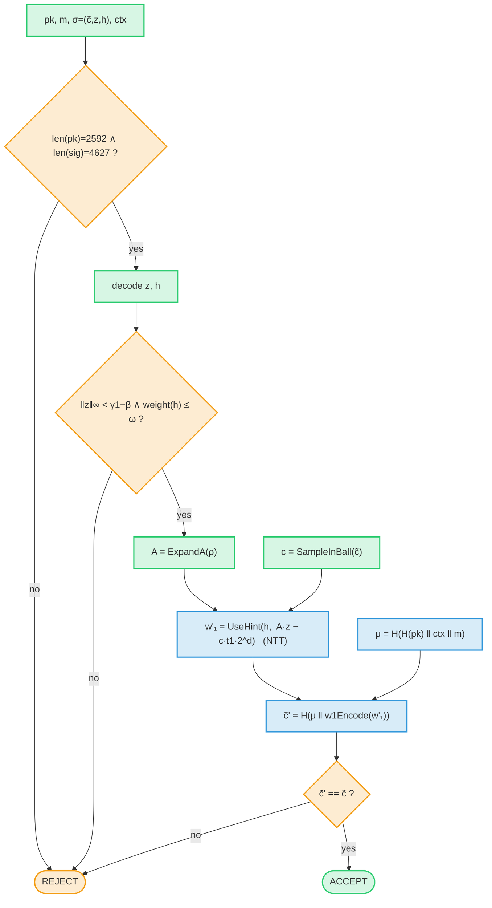

**🔒 Security.** Verify recomputes the challenge from `w'₁` and checks it matches `c̃`. A forgery requires a
SelfTargetMSIS solution. Go: `Verify` (`mldsa87.go`); the length/range guards (audit H1/H2/H3) make it
**panic-free on adversarial input** — important because in consensus a panic is a remote-DoS primitive.

**🛡 Side-channel.** Verify touches **no secret**, so all of its branches (amber) are on public data and are
free. The same code is the ML-ADSA verifier — the aggregate *is* a FIPS-204 signature.

### 2.4 FIPS-204 step ↔ diagram ↔ Go-symbol traceability

Each algorithm step maps to a FIPS-204 sub-routine (algorithm number) and a reference-code symbol, so the
faithfulness of the diagrams is checkable line-by-line. (`*P` symbols are the parameter-generic forms in
`verify_param.go`/`sign_param.go`; the un-suffixed forms are the -87 reference in `mldsa87.go`. The two are
asserted equal for -87.)

**KeyGen** (FIPS-204 Alg 1 / 6, `KeyGenP`):

| Step | FIPS-204 | Diagram | Go symbol |
|---|---|---|---|
| `(ρ,ρ',K) ← H(ξ‖k‖ℓ)` | Alg 6 | §2.1, §2.1.1 | `KeyGenP` |
| `Â ← ExpandA(ρ)` | Alg 32 | §2.1.1 | `expandAP` / `ExpandA` |
| `(s1,s2) ← ExpandS(ρ')` | Alg 33 | §2.1.1 | `expandSP` / `rejBoundedPolyP` |
| `t = INTT(Â∘NTT(s1)) + s2` | Alg 41/42 | §1, §2.1.2 | `ntt` / `pwacc` / `intt` |
| `(t1,t0) = Power2Round(t)` | Alg 35 | §2.1, §2.1.2 | `power2round` |
| `pk = pkEncode(ρ,t1)` | Alg 22 | §2.1.3 | `pkEncodeP` / `PkEncode` |
| `sk = skEncode(…, tr=H(pk))` | Alg 24 | §2.1.3 | `KeyGenP` / `SkDecode` codec |

**Sign** (FIPS-204 Alg 2 / 7, `SignP`):

| Step | FIPS-204 | Diagram | Go symbol |
|---|---|---|---|
| `μ = H(H(pk)‖ctx‖m)` | Alg 2 | §2.2 | `computeMu` |
| `y = ExpandMask(ρ'',κ)` | Alg 34 | §2.2 | `expandMaskP` |
| `w = A·y`; `w1 = HighBits(w)` | Alg 41, 37/36 | §2.2 | `ntt`/`intt`, `highbitsP`/`decomposeP` |
| `c̃ = H(μ‖w1Encode(w1))` | Alg 28 | §2.2 | `w1EncodeP`/`w1Encode`, `shake256` |
| `c = SampleInBall(c̃)` | Alg 29 | §2.2 | `sampleInBallP` / `SampleInBall` |
| `z = y + c·s1`; `‖z‖∞ < γ1−β` | Alg 7 | §2.2 | `padd`, `maxAbsVec` |
| `r0 = LowBits(w−c·s2)`; bound | Alg 38 | §2.2 | `lowbitsP` |
| `h = MakeHint(−c·t0, …)`; `wt ≤ ω` | Alg 39 | §2.2 | `makeHintP` |
| `σ = sigEncode(c̃,z,h)` | Alg 26 | §2.2, §2.1.3 | `sigEncodeP` / `SigEncode`, `hintPack` |

**Verify** (FIPS-204 Alg 3 / 8, `Verify`):

| Step | FIPS-204 | Diagram | Go symbol |
|---|---|---|---|
| decode `pk`, `σ`; length guard | Alg 23, 27 | §2.3 | `PkDecode`, `SigDecode`, `Verify` |
| bound `‖z‖∞`, hint weight `≤ ω` | Alg 8 | §2.3 | `cabs`, weight loop in `Verify` |
| `Â = ExpandA(ρ)`; `c = SampleInBall(c̃)` | Alg 32, 29 | §2.3 | `ExpandA`, `SampleInBall` |
| `w'1 = UseHint(h, A·z − c·t1·2^d)` | Alg 40, 41/42 | §2.3 | `useHintP`/`useHint`, `ntt`/`intt` |
| `c̃' = H(μ‖w1Encode(w'1))`; compare | Alg 28 | §2.3 | `computeMu`, `w1Encode`, `Verify` |

---

## 3. ML-ADSA end-to-end

### 3.1 The one-line idea: the additive dual of BLS

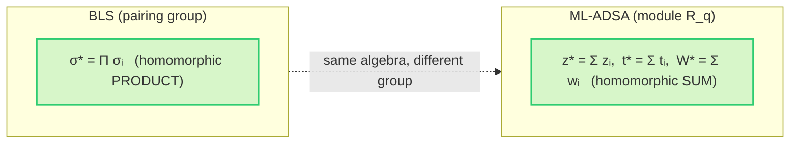

Aggregation is literally **addition in `R_q`**. The summed key `t* = Σ tᵢ` is itself a bona-fide ML-DSA key
(a sum of MLWE samples is an MLWE sample), and `z* = Σ zᵢ = (Σ yᵢ) + c̃*·(Σ s1ᵢ)` is the response of a single
signer holding that key — so `σ* = (c̃*, z*, h*)` verifies under the **unmodified** FIPS-204 verifier.

### 3.2 The non-interactive combine — no coordinator, no challenge sent, one broadcast per signer

> **This is _not_ an interactive (MuSig-style) handshake.** There is no aggregator that collects nonce
> commitments, replies with a challenge, and then gathers responses across rounds. Non-interactivity comes
> from three facts, and it is important to draw it that way:
>
> 1. **Deterministic nonces.** `y_i = DeriveNonce(msk_i, C)` — so each commitment `w_i = A·y_i` is fixed by
>    `(key_i, content C)` and is **pre-published** alongside `t_i` in the epoch key-tree / commitment pool,
>    in bulk, ahead of time. It is *not* a per-signature interactive "round 1."
> 2. **Self-derived challenge.** Every signer **computes `c*` itself** from the public cohort commitments
>    `{w_j}` (`c* = H(μ ‖ HighBits(W*))`). **Nobody sends a challenge.**
> 3. **Single broadcast.** Each signer therefore emits its response `z_i` as **one** message (exactly like a
>    BLS attestation gossip), and **any untrusted party just sums** `{t_j, w_j, z_j}` into `σ*`.

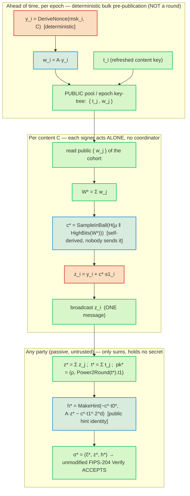

**On "two rounds."** There *is* a logical data dependency — `c*` depends on `W* = Σ w_j`, so commitments
must exist before responses (this is the Fiat–Shamir binding, and exactly why finished aggregates are
*homomorphic but not freely mergeable*). But that dependency is satisfied by **deterministic
pre-publication**, not by an interactive exchange: no signer waits on a message *from* another signer or
*from* a coordinator, and no challenge is ever transmitted. The earlier framing of this as an
aggregator-driven "round 1 / round 2" would describe the interactive MuSig design that ML-ADSA explicitly is
**not** (see [[ml-adsa-noninteractive]]).

**🔒 Security.** The self-derived `c*` binds the **entire** commitment `W*`, which is exactly what defeats the
Drijvers/ROS attack — giving concurrent security with **no ROS/AGM/OMDL assumption**
(`unbiasable_challenge`, `challenge_adversary_independent`; paper §6.4). Determinism + the public,
predictable content `C = (slot, committee)` also enforces the one-time discipline (fixed cohort ⇒ fixed `c*`
⇒ no nonce reuse). Go: the reference combine is `AggregateF` (`construction_f.go`) and the parameterized
`AggregateP` (`aggregate_param.go`); the per-node **decentralized** combine over public broadcasts is
`CombineFromPublic` (qrysm `mladsa/decentralized.go`), asserted byte-identical to `AggregateF` by
`TestDecentralized_EqualsAggregateF`.

**🛡 Side-channel.** The only secret-touching step is each signer's **local** `z_i = y_i + c*·s1_i` (the §2.2
constant-time path); the published `z_i` is HVZK-simulatable, so broadcasting it leaks nothing. The summing
party runs **entirely on public data** — `t_j, w_j, z_j` are public, and `rr2 = A·z* − c*·t1*·2^d` is the
public hint identity (computed *without* `s2*`). Its only branch — **ABSTAIN** when `‖z*‖∞ ≥ γ1−β` — is a
test on a **public sum**, so it leaks nothing and needs no resampling round.

### 3.3 The layered construction (L0–L3)

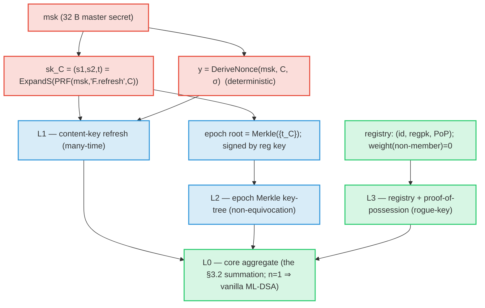

- **L1 (many-time).** Distinct contents `C` give independent keys (PRF security), so aggregating across many
  contents is safe and per-content security equals single ML-DSA (`ml_adsa_F_manytime.ec`,
  `ml_adsa_F_refresh.ec`). Nonces are **deterministic** — no per-signature RNG — subject to the **one-time
  discipline**: a `(signer, C)` signs at most once (enforced by `DurableOneTimeGuard`, fsync'd, write-ahead).
- **L2 (non-equivocation, properties F-C8/C9).** A `t_C` is accepted only if it is a proven member of a
  registration-signed epoch root. Go: `EpochKeyTreeBuild` + `(EpochKeyTree).PathFor` + `MerkleVerify`
  (`construction_f.go`, `merkle.go`), checked in aggregation by `ProvenanceVerifyF`; proofs: Coq
  `ml_adsa_F_provenance.v` and Gobra `merkleBinding`. ("VerifyEpochRoot"/"VerifyContentInTree" are the
  *prose* names for these checks in the spec, not Go symbols.)
- **L3 (rogue-key).** Recognized weight comes from the public registry + PoP; non-registered signers
  (decoys) have weight 0 and **cannot change outcomes** (`ml_adsa_rogue_proof.ec`, Coq
  `ml_adsa_F_decisions.v`, Gobra `filterRecognized`).

**🛡 Side-channel.** `msk` and the refreshed `sk_C`/nonce are the only long-lived secrets; they feed the
deterministic PRF (constant work) and then the §2.2 signer path. The one-time guard prevents the *one* fatal
leak of deterministic signing (two responses under the same nonce ⇒ key recovery) — see
[[deterministic-nonce-security]].

### 3.4 The whole flow with 1, 2, 3, … N signers

Two views of the *same* process across an `N`-signer cohort. The **temporal** view reads top-to-bottom as
time; the **structural** view reads left-to-right as data flow. (Remember §3.2: this is non-interactive —
commitments are deterministic and pre-published, each signer self-derives `c*`, and the summing party is
passive. No one sends a challenge.)

**Temporal — steps in time (each signer acts on its own; the pool is a passive medium):**

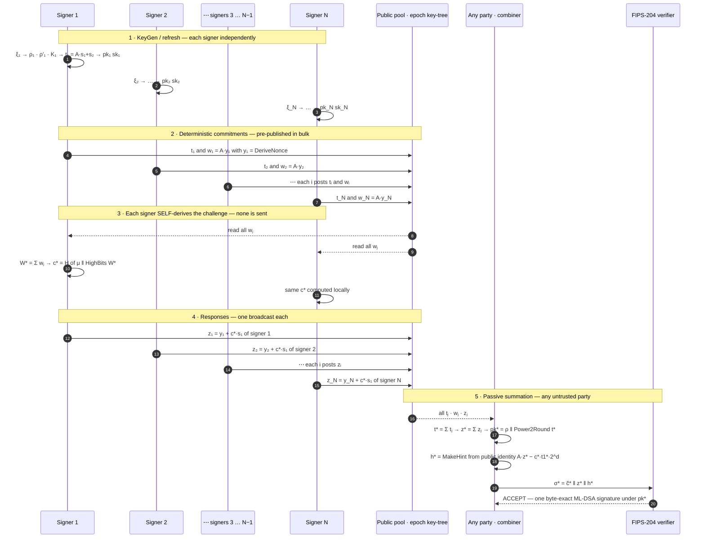

**Structural — all parties and steps at once (data flow left-to-right):**

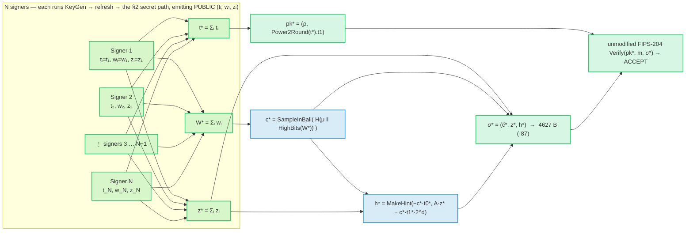

Both views show the **constant-size** payoff: no matter how large `N` grows, the sums `t*, W*, z*` and the
final `σ*` stay one ML-DSA-87 object (2592 B key, 4627 B signature) — the only `N`-dependent datum is the
public participation bitmap. Each signer's secret work (the red path of §2.2) happens **locally** before it
emits its public `(tᵢ, wᵢ, zᵢ)`; everything drawn here downstream of the broadcasts is public.

---

## 4. Security guarantees — the reduction chains

### 4.1 EUF-CMA (ROM keystone)

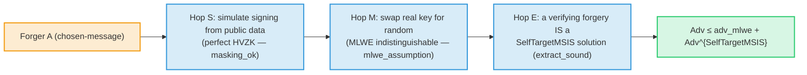

Machine-checked, admit-free: `msufcma_uncond` (`ml_adsa_euf.ec`). **SUF-CMA** adds the same-`(μ,c)`-new-`(z,h)`
collision term, bundled as `StrongSIS = SelfTargetMSIS ∨ Module-SIS` (`sufcma_uncond`, `ml_adsa_suf.ec`).

### 4.2 QROM (post-quantum) and equivalence-class hardness

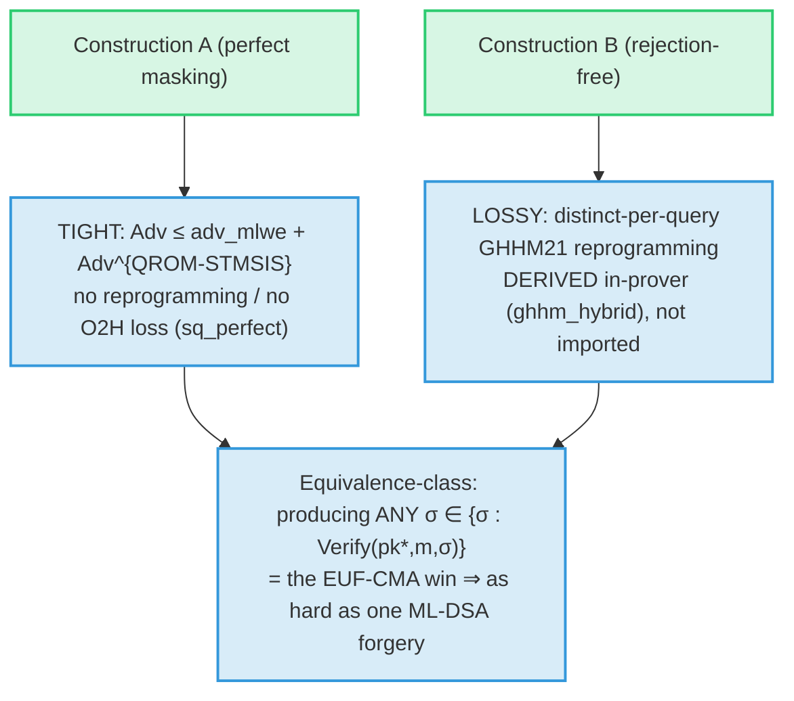

`qrom_eufcma_uncond` (A, tight), `qrom_eufcma_lossy` + `ml_adsa_qrom_ghhm.ec` (B, derived bound),
`equiv_class_guess_bound` / `qrom_equiv_class_uncond` (multiplicity gives no advantage). All inherit the
**parameter set's** NIST category — 2/3/5 for ML-ADSA-44/65/87 (the proofs quantify over `(k,ℓ,η,τ,γ,ω)`).

### 4.3 Which assumption guards which step

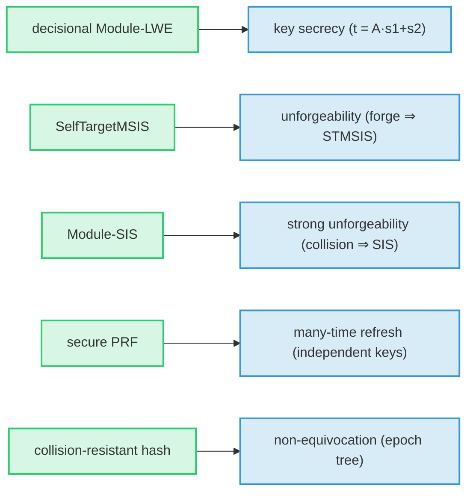

These are **exactly ML-DSA's own assumptions** — ML-ADSA adds no new hardness assumption.

---

## 5. Side-channel & leak-freedom — how it is guaranteed

The constant-time goal: **no secret value influences a branch, a memory-access pattern, or instruction
timing.** The posture and its evidence are in `docs/34 §2`; here is the picture.

### 5.1 The secret-data-flow map

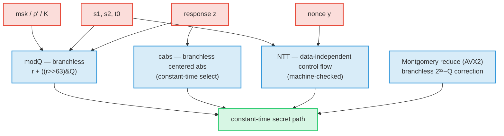

Every red→blue edge is an operation on a secret, and every blue node is **branchless / data-independent**.

### 5.2 Branchless reductions (the pattern, before → after)

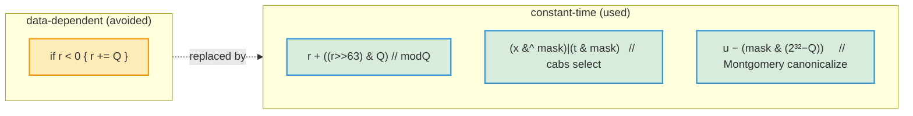

> Honest note: Go's compiler often lowers a naive `if r<0 { r+=Q }` to a branchless `cmov` anyway — which is
> *why* the dudect positive control had to use a data-dependent **loop count**, not a sign test, to register
> leakage (`ct_test.go`). The code uses the explicit branchless forms regardless, so the property does not
> depend on a compiler optimization (`docs/34 §2b`).

### 5.3 The NTT data-independence — as a proof obligation

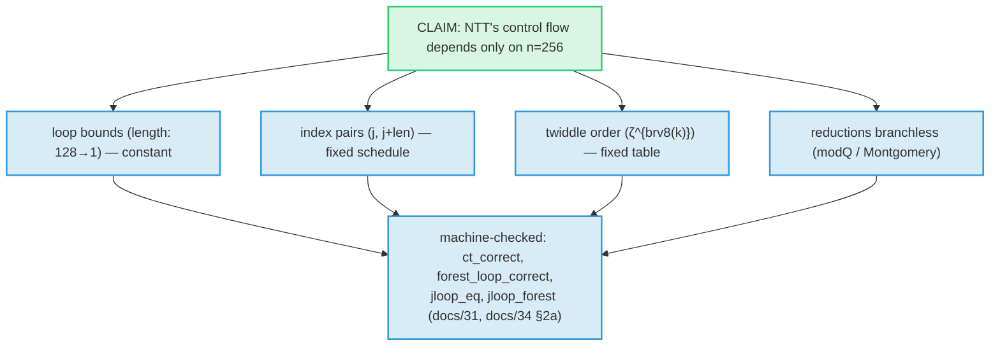

This is stronger than "we wrote it carefully": the iterative loop the code runs is *proved equal* to the
recursion, with termination, and the literal `a[j]`/`a[j+len]` index arithmetic is checked — so the
data-independence is a theorem, not a comment.

### 5.4 The validation pipeline (defense in depth)

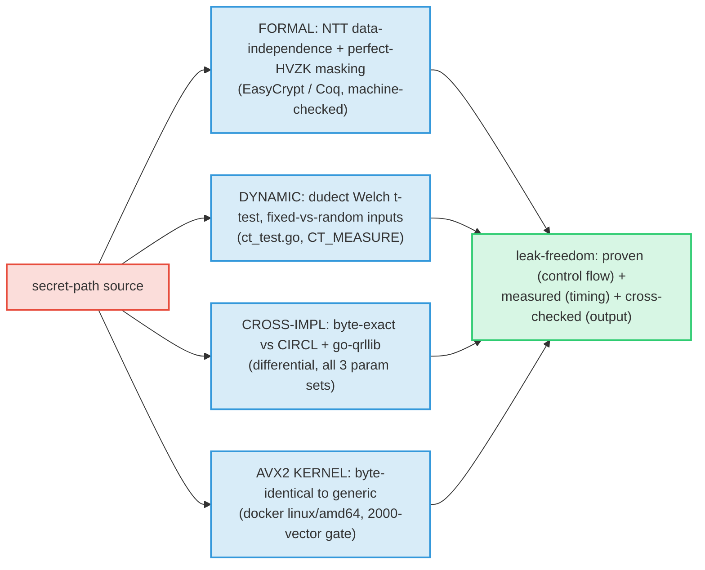

### 5.5 Constant-time checklist (decision view)

```mermaid
flowchart TD
  q0{"Does the op touch a SECRET?"}:::danger
  q1{"Branch / loop count<br/>depends on the secret?"}:::danger
  q2{"Memory access index<br/>depends on the secret?"}:::danger
  q3{"Variable-latency instr<br/>on secret (div/mod)?"}:::danger
  okp(["free — public data"]):::public
  fix1["→ branchless select / masking (modQ, cabs)"]:::derived
  fix2["→ data-independent schedule (NTT), or<br/>determinism + public-sum abstain (aggregate)"]:::derived
  fix3["→ Montgomery/branchless reduction (no %Q on secret)"]:::derived
  ct(["CONSTANT-TIME ✓"]):::public
  q0 -- no --> okp
  q0 -- yes --> q1
  q1 -- yes --> fix1 --> ct
  q1 -- no --> q2
  q2 -- yes --> fix2 --> ct
  q2 -- no --> q3
  q3 -- yes --> fix3 --> ct
  q3 -- no --> ct
  classDef danger fill:#f39c1230,stroke:#f39c12,stroke-width:2px;
  classDef public fill:#2ecc7130,stroke:#2ecc71,stroke-width:2px;
  classDef derived fill:#3498db30,stroke:#3498db,stroke-width:2px;
```

**Honest residual.** The one inherently data-dependent element is the **rejection-loop attempt count** in
single-signer signing (§2.2) — universal to Fiat–Shamir-with-aborts. ML-ADSA's deployment removes it from
the *aggregate* path (deterministic nonces + abstain on the *public* sum), and a fully hardened
single-signer build (constant-time sampler, masking) is the remaining engineering item (`docs/34 §2`,
`docs/32 #7`). Microarchitectural leakage on native silicon (`dudect`/`ctgrind` on x86) is a deployment-time
validation step, not yet run on hardware here.

---

## 6. Traceability and reproduction

Each diagram maps a step to its **Go symbol** and its **proof artifact**; the full row-by-row matrix is the
verification dossier (`docs/31`) and the implementation-conformance map (`docs/20`). Counts are the single
source of truth from `formal/count-artifacts.sh` (**36 artifacts / 244 lemmas / 50 genuineness / 6 Gobra**).

```
# regenerate the proof tallies these diagrams reference
cd formal && zsh count-artifacts.sh

# the constant-time evidence behind §5
cd go-mladsa && CT_MEASURE=1 go test -run TestConstantTime -v # dudect Welch t-test
cd go-mladsa && ./validate-avx2-docker.sh                    # AVX2 byte-identity (incl. NTT)
cd go-mladsa && go test -run 'TestCoreVsCIRCL|TestParamVerifyVsCIRCL'   # cross-impl differential
```

**Boundary (unchanged from the rest of the corpus).** The machine-checked proofs are about the
algorithm/model and the NTT's structure; the Go is byte-anchored to two independent FIPS-204 verifiers
(measurement). The diagrams visualize *both* surfaces and which is which — they do not assert a code-level
proof of the Go source beyond the Gobra structural theorems (`docs/22`).
