# ML-DSA & ML-ADSA — Visual Walkthrough, End-to-End, with Security & Side-Channel Guarantees

This document is the **picture book** for the corpus: every step of **ML-DSA** (FIPS-204) and of
**ML-ADSA** (the aggregate construction) drawn as a diagram, end-to-end, together with **what guarantees
each step's security** and **how each step is kept free of side-channels / secret leaks**. It is a
navigation layer over the authoritative text — the formal spec (`docs/30`), the verification dossier
(`docs/31`), the optimization / constant-time posture (`docs/34`), and the research paper (`paper/`).

The diagrams are [Mermaid](https://mermaid.js.org/) — they render natively on GitHub and on the docs site,
and the source is plain text (auditable, deterministic, no binary assets).

---

## 0. How to read these diagrams

Every value is colored by its **secrecy class**, because the side-channel story is exactly "which wires
carry secrets, and is every gate that touches them data-independent?"

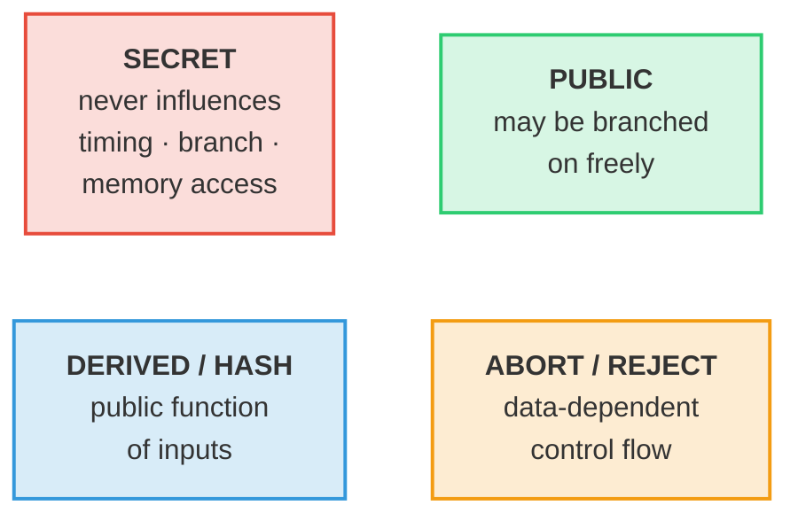

- **Red = secret.** The whole constant-time argument is: every operation on a red wire is straight-line
  and branchless (§5).
- **Green = public.** Anything an adversary already knows; branching on it is free.
- **Blue = derived/hash.** A deterministic public function (SHAKE, encode, NTT of a public value).
- **Amber = a data-dependent branch** — flagged explicitly so the residual control-flow surface is visible
  rather than hidden.

The class is carried by a **colored border + a translucent tint**, and the box/text colors follow the page
theme — so the diagrams stay legible in both light and dark mode (and on GitHub).

> **Two levels of detail (nothing is hidden).** The top-of-section flowcharts give the *shape* of each
> algorithm; the **finer detail is then drawn out explicitly** for academic readers — the
> domain-separation tags in seed/XOF expansion (§2.1.1), the **NTT-domain arithmetic** behind every
> polynomial product (§1 and §2.1.2), and the **`pkEncode`/`skEncode`/`sigEncode` byte layouts** (§2.1.3) —
> with a FIPS-204-step ↔ diagram ↔ Go-symbol traceability map in §2.4. The byte-exact authoritative
> procedure remains the formal specification (`docs/30`) and the reference code; this section reproduces the
> load-bearing low-level structure rather than abstracting it away.

Each diagram is followed by **🔒 Security** (what makes the step sound) and **🛡 Side-channel** (how the step
avoids leaking), with pointers to the Go symbol and the proof artifact.

---

## A primer for new readers — notation & the key operations

New to lattice signatures? Read this first; every later diagram reuses these symbols and operations. Each
operation is broken out three ways: **Math** (the formula), **Compute** (what the code does), and **Picture**
(the intuition). The site renders math with MathJax; on GitHub the same `$…$` shows inline.

### Notation key

| Symbol | Name | Plain meaning |
|---|---|---|
| $q = 8380417$ | the modulus | a prime; all coefficients live in $\{0,\dots,q-1\}$ ($q = 2^{23}-2^{13}+1$) |
| $n = 256$ | ring degree | every polynomial has 256 coefficients |
| $R_q$ | the ring | polynomials of degree $<256$, coefficients mod $q$, reduced mod $X^{256}+1$ |
| $k,\ell$ | matrix shape | $A$ is $k\times\ell$ over $R_q$ (e.g. $8\times7$ for -87) |
| $A$ | public matrix | random, expanded from the seed $\rho$ |
| $s_1,s_2$ | secret key | **small** polynomials ($\lVert\cdot\rVert_\infty\le\eta$) |
| $t = As_1+s_2$ | public key core | a Module-LWE sample (hides $s_1,s_2$) |
| $t_1,t_0$ | hi/lo of $t$ | $t_1$ public (in `pk`), $t_0$ secret (in `sk`) |
| $y$ | masking nonce | random, $\lVert y\rVert_\infty<\gamma_1$ |
| $w = Ay$ | commitment | the "first move" of the proof |
| $w_1$ | high bits of $w$ | what the verifier reconstructs |
| $c$ | challenge | sparse $\pm1$ polynomial, $\tau$ nonzeros |
| $\tilde c$ | challenge hash | the seed that defines $c$ (stored in $\sigma$) |
| $z = y + c\,s_1$ | response | the "answer"; must be leak-free |
| $h$ | hint | tiny carry-correction bits |
| $\mu$ | message rep. | $H(H(pk)\,\Vert\,ctx\,\Vert\,m)$ |
| $\eta,\tau,\gamma_1,\gamma_2,\beta,\omega$ | bounds | secret size, challenge weight, mask range, rounding, $\beta=\tau\eta$, max hint weight |
| $\hat{x}$ | NTT of $x$ | $x$ transformed into the NTT domain |
| $\odot$ | pointwise mult. | coefficient-wise multiply in the NTT domain |
| $\lVert x\rVert_\infty$ | infinity norm | the largest coefficient magnitude (centered) |

### The ring $R_q$ — where everything lives

> **Math.** $R_q = \mathbb{Z}_q[X]/(X^{256}+1)$. An element is $a_0 + a_1X + \dots + a_{255}X^{255}$ with each
> $a_i \in \{0,\dots,q-1\}$. Multiplication wraps around using $X^{256} = -1$.
> **Compute.** A polynomial is just an array of 256 integers (`[]int64` in the code). Add = add the arrays
> mod $q$; multiply = polynomial convolution then reduce mod $X^{256}+1$ and mod $q$.
> **Picture.** A clock with $q$ ticks for each of 256 slots; arithmetic that overflows wraps around the
> clock, and the $X^{256}=-1$ rule folds the top half back with a sign flip.

### NTT / INTT — fast multiplication

> **Math.** Because $q\equiv1 \pmod{512}$, $X^{256}+1$ factors into 256 linear pieces, so a polynomial is
> determined by its values at the 256 roots. The NTT is that evaluation; it turns convolution into
> coordinate-wise product: $\widehat{f\cdot g} = \hat f \odot \hat g$, and $\mathrm{INTT}(\hat f)=f$.
> **Compute.** An in-place network of "butterflies" (§1), $O(n\log n)$ instead of $O(n^2)$. Multiply two
> polynomials by `NTT → ⊙ → INTT`.
> **Picture.** Like the FFT: hard work (convolution) becomes easy (elementwise multiply) after a change of
> coordinates, then you transform back.

### Module-LWE — why $t = As_1+s_2$ is safe to publish

> **Math.** Given random $A$ and $t = As_1+s_2$ with **small** $s_1,s_2$, recovering $(s_1,s_2)$ is the
> Module-LWE problem; distinguishing $t$ from uniform is its decision form. Both are believed hard even for
> quantum computers (NIST Category 2/3/5 for -44/-65/-87).
> **Compute.** One matrix–vector product in the NTT domain plus a small-noise add (§2.1.2).
> **Picture.** A linear system $As_1=t$ that has been *fuzzed* by a little noise $s_2$: you can see $A$ and
> $t$, but the fuzz hides the exact solution.

### Decompose / HighBits / LowBits — coarse + fine split

> **Math.** With $\alpha = 2\gamma_2$, write $r = r_1\alpha + r_0$ where $r_0\in(-\alpha/2,\,\alpha/2]$. Then
> $\mathrm{HighBits}(r)=r_1$, $\mathrm{LowBits}(r)=r_0$.
> **Compute.** Round $r$ to the nearest multiple of $\alpha$ (that index is $r_1$) and keep the remainder
> $r_0$ (`decomposeP`).
> **Picture.** Reading a ruler: the big tick you're nearest to ($r_1$) plus the small offset from it ($r_0$).

### Power2Round — split off the low bits of the key

> **Math.** $r = r_1\,2^d + r_0$ with $d=13$, $r_0\in(-2^{d-1},2^{d-1}]$. For the key: $t_1$ (high, public),
> $t_0$ (low, secret).
> **Compute.** Bit-shift: $t_1$ is "$t$ with its low 13 bits dropped", $t_0$ is those low bits centered
> (`power2round`).
> **Picture.** Splitting a price into "dollars" ($t_1$, shown publicly) and "cents" ($t_0$, kept private).

### SampleInBall — the challenge $c$

> **Math.** $c\in R_q$ with exactly $\tau$ coefficients equal to $\pm1$ and the rest $0$; so $\lVert
> c\rVert_\infty=1$ and $\lVert c\rVert_1=\tau$.
> **Compute.** Hash $\tilde c$ to a stream, then Fisher–Yates-place $\tau$ signs (`sampleInBallP`).
> **Picture.** A mostly-empty vector with a few $+1/-1$ spikes — small enough that $c\cdot s_1$ stays small.

### Rejection sampling (Fiat–Shamir *with aborts*) — the leak-free trick

> **Math.** Output $z=y+cs_1$ **only if** $\lVert z\rVert_\infty<\gamma_1-\beta$ (and the other bounds);
> otherwise pick a fresh $y$ and retry. This makes the distribution of accepted $z$ **independent of the
> secret** $s_1$.
> **Compute.** A loop that re-draws the nonce until all bound checks pass (the amber loop in §2.2).
> **Picture.** Re-rolling the dice until the result lands in a "safe window" that looks the same no matter
> what the secret is — so the published $z$ tells an attacker nothing about $s_1$.

### MakeHint / UseHint — 1-bit carry corrections

> **Math.** A single bit per coefficient recording whether adding the secret term flips the HighBits value;
> $\mathrm{UseHint}$ then recovers $w_1$ exactly from public data $Az-c\,t_1 2^d$ without knowing $t_0$.
> **Compute.** `makeHintP` sets the bit when $\mathrm{HighBits}$ would differ; `useHint` applies the $\pm1$
> correction. The hint is run-length packed into $\sigma$.
> **Picture.** A margin note saying "carry the 1 here" so the verifier, lacking the secret low bits, still
> arrives at the same rounded value.

### The aggregation idea — sum of responses = response of the summed key

> **Math.** $\displaystyle z^* = \sum_i z_i = \sum_i (y_i + c\,s_{1,i}) = \Big(\sum_i y_i\Big) + c\sum_i
> s_{1,i}$ — exactly the response of *one* signer whose key is $t^*=\sum_i t_i$ and whose nonce is $\sum_i
> y_i$. Everything is **linear**, so it adds.
> **Compute.** Coefficient-wise vector addition of the public contributions (§3.2).
> **Picture.** This is BLS's "multiply the signatures" move, done with **+** in a lattice instead of **×** in
> a pairing group.

### HVZK / "perfect masking" — the signature hides the secret

> **Math.** The accepted $z$ is uniform on its allowed window regardless of $s_1$; equivalently, a simulator
> with no secret can produce identically-distributed signatures. This is the core of the security proof and
> is machine-checked (`reject_uniform`, `masking_perfect_concrete`).
> **Compute.** Guaranteed by the rejection step above; nothing extra at runtime.
> **Picture.** The signature is a "frosted glass" view: provably the same shape whether or not you know the
> secret behind it.

---

## Geometry & spatial intuition (for new readers)

The equations above describe *what* the objects are; these pictures show *where they live and how they move*.
They are monospace sketches (so they read in light or dark, here and on GitHub). Schematic, not to scale.

### The workspace — one polynomial, and the module of them

A single element of $R_q$ is a row of 256 coefficient slots. The matrix `A`, the keys, and the responses are
small grids whose every **cell is one such 256-slot polynomial**:

```
one polynomial in R_q  =  256 slots, each a value in [0, q):

 idx 0    1    2    3              254  255
   ┌────┬────┬────┬────┬─ ... ─┬────┬────┐
   │ a0 │ a1 │ a2 │ a3 │       │a254│a255│      multiply wraps with X²⁵⁶ = −1
   └────┴────┴────┴────┴─ ... ─┴────┴────┘      (top half folds back, sign-flipped)

the module equation  t = A·s1 + s2   (each ▦ is a whole polynomial like the row above):

         s1 (ℓ=7 polys)
          ▦ ▦ ▦ ▦ ▦ ▦ ▦
        ┌───────────────┐   ┌─┐      ┌─┐        ┌─┐
   A →  │ ▦ ▦ ▦ ▦ ▦ ▦ ▦ │ · │▦│  +   │▦│   =    │▦│   ← t  (k=8 polys)
 (8×7)  │ ▦ ▦ ▦ ▦ ▦ ▦ ▦ │   │▦│      │▦│        │▦│
        │   … 8 rows …   │   │⋮│      │⋮│        │⋮│
        └───────────────┘   └─┘      └─┘        └─┘
                          row·s1   + s2(k=8)  =  t
```

### Module-LWE — the security geometry

The columns of `A` span a **lattice** (a regular grid of points). `A·s1` is one lattice point; adding the
tiny noise `s2` nudges `t` *just off* a grid point. Publishing `t` is safe because finding the nearest grid
point (hence `s1,s2`) is the hard lattice problem — even for a quantum computer.

```
 ·      ·      ·      ·      ·        · = lattice point (some A·s1)
 ·      ·      ·      ·      ·
 ·      ·    ·∘ ← A·s1                ∘ = the exact lattice point
 ·      · ╱  •  t = A·s1 + s2         • = t, sitting a hair off ∘
 ·      ·      ·      ·      ·            (offset = small noise s2)
 ·      ·      ·      ·      ·
   given  •  and the grid, find ∘  ⇒  recover the secret   (believed HARD)
```

### Decompose / HighBits / LowBits — a ruler

Each coefficient is read like a ruler: the nearest **big tick** (a multiple of `α = 2γ₂`) is the HighBits,
and the small signed offset to it is the LowBits.

```
 0        α        2α       3α       4α          big ticks = multiples of α
 ├────────┼────────┼────────┼────────┼─ … ─┤
                 r1·α    ↑r
                     └─r0─┘                     r0 = signed distance to nearest tick
 HighBits(r) = r1   (which big tick)            LowBits(r) = r0  (the leftover)
```

### Power2Round — splitting a coefficient's bits

`t` is sawn along a bit boundary: the high bits go public (`t1` in `pk`), the low 13 bits stay secret
(`t0` in `sk`).

```
 bit 22                              bit 13 │ bit 12                 bit 0
 ┌──────────────────────────────────────┐  │  ┌──────────────────────────┐
 │   t1  =  high bits   (PUBLIC, in pk)  │  │  │  t0 = low 13 bits (SECRET)│
 └──────────────────────────────────────┘  │  └──────────────────────────┘
                                t  =  t1·2¹³  +  t0
```

### SampleInBall — the challenge is a sparse sign vector

`c` is mostly zeros with exactly `τ` spikes of `±1`. That sparsity is *why* `c·s1` stays small (it is just
`τ` shifted, signed copies of `s1` summed).

```
 c =  256 slots, exactly τ are ±1, rest 0:
   ┌─┬─┬─┬─┬─┬─┬─┬─┬─┬─┬─┬─┬─ … ─┬─┬─┐
   │0│0│+│0│0│−│0│0│0│+│0│0│     │−│0│      ‖c‖∞ = 1   (each spike is ±1)
   └─┴─┴─┴─┴─┴─┴─┴─┴─┴─┴─┴─┴─ … ─┴─┴─┘      ‖c‖₁ = τ   (count of spikes, 60 for -87)
```

### The "realm of answers" — the accept window (rejection sampling)

The response `z` may only be released if **every** coefficient lands inside a safe window strictly inside the
full mask range. Inside the window, `z` looks identical to a secret-free sample; near the edges it could leak,
so those attempts are thrown away and retried.

```
 −γ1            −(γ1−β)            0            +(γ1−β)            +γ1
  ├───REJECT─────┼══════════════ ACCEPT ══════════════┼─────REJECT───┤
  │  (too large; │   z here is indistinguishable      │  (too large) │
  │  may leak s1)│   from a secret-free distribution  │              │
                 └────────── leak-free zone ──────────┘
 release σ only if  ‖z‖∞ < γ1 − β   (every coordinate in the ═══ window); else resample
```

### Aggregation — adding the answers tip-to-tail

Because every operation is linear, the signers' responses **add** like vectors, and so do their keys — so the
sum verifies under the single summed key. (BLS *multiplies* signatures in a group; ML-ADSA *adds* them in a
lattice — the same idea, dual operation.)

```
   z1 ─────▶
            z2 ───▶
                   z3 ──────▶                  z* = z1 + z2 + z3 + … + zN
   ●─────────────────────────▶  z*             t* = t1 + t2 + … + tN
                                               ⇒  z* verifies under the ONE key t*
```

---

## 1. The shared base layer: the ring `R_q` and the NTT

Both schemes live in `R_q = Z_q[X]/(X²⁵⁶+1)`, `q = 8380417`, `n = 256`. All polynomial multiplication goes
through the **Number-Theoretic Transform** (NTT) — the single hottest operation, and therefore the focus of
both the optimization and the constant-time work.

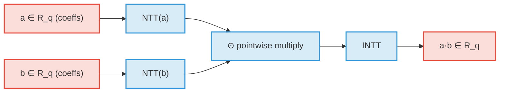

The NTT itself is a fixed network of **Cooley–Tukey butterflies** — the control flow (which indices pair
with which, the loop bounds, the twiddle schedule `ζ = 1753`) depends only on `n = 256`, **never on the
coefficient values**:

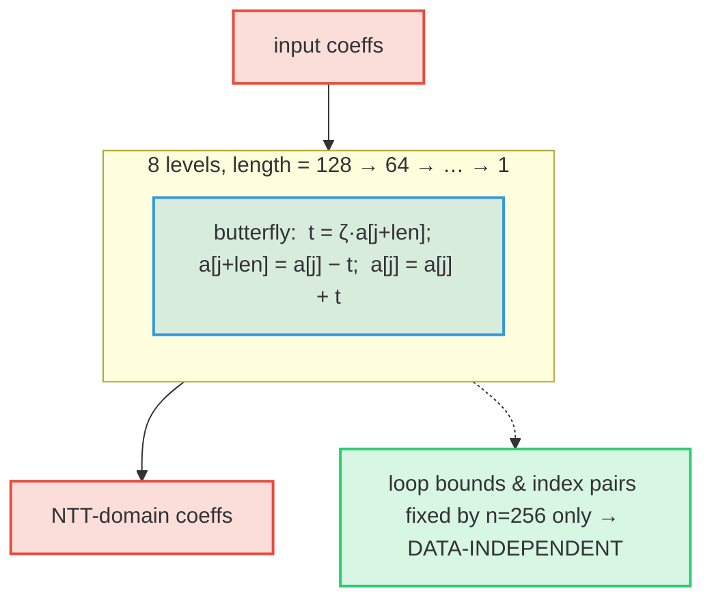

**🔒 Security.** The NTT is a *ring isomorphism* — multiplication via NTT is exact (`NTT(p·q)=NTT(p)⊙NTT(q)`,
`INTT∘NTT=id`). This is machine-checked from first principles (`ct_correct`, `ntt_tree_correct`,
`forest_loop_correct`, and the literal index arithmetic `jloop_eq`/`jloop_forest`), and the Montgomery
reduction constant `q·qinv ≡ 1 (mod 2³²)` is proved (`ml_adsa_montgomery.ec`). See `docs/31` and the paper §1.4.

**🛡 Side-channel.** The butterfly network is **straight-line with data-independent control flow** — this is
the property that makes the NTT constant-time, and it is **machine-backed** (`docs/34 §2a`). The reductions
inside the butterfly are branchless (`modQ` = `r + ((r>>63)&Q)`; the AVX2 kernel uses a Montgomery reduce
with a branchless `2³²−Q` correction, byte-identical to generic — `ntt_amd64.s`, `montgomery.go`). Go
symbols: `nttGeneric`/`inttGeneric` (`mldsa87.go`), `nttAVX2`/`inttAVX2` (`ntt_amd64.go`).

---

## 2. ML-DSA-87 (FIPS-204) end-to-end

### 2.1 KeyGen (Algorithm 1)

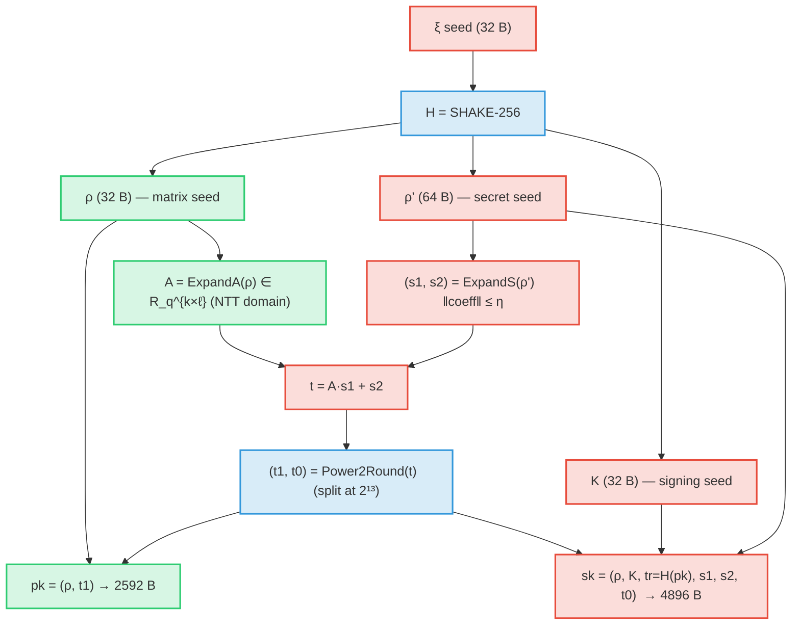

**🔒 Security.** `t = A·s1 + s2` is a **Module-LWE sample**: recovering `(s1,s2)` from `(A,t)` is the MLWE
problem at Category 5. `t1` (the published high bits) leaks nothing usable; `t0` is kept secret in `sk`.
Go: `KeyGenP` (`sign_param.go`). Assumption: decisional MLWE.

**🛡 Side-channel.** `s1,s2` are sampled by rejection from a SHAKE stream (`rejBoundedPolyP`); the *number*
of XOF reads can vary, but it is a function of the **public seed expansion**, not of any pre-existing
secret, and the sampled coefficients never steer a secret-dependent branch downstream. `A·s1+s2` is the
constant-time NTT path of §1.

#### 2.1.1 Finer detail — seed expansion & domain separation

The single seed `ξ` is split by a SHAKE-256 call that is **domain-separated by the parameter set** (the
`k,ℓ` bytes), and every matrix entry / secret polynomial is then derived under a **distinct index tag**, so
no two XOF streams collide:

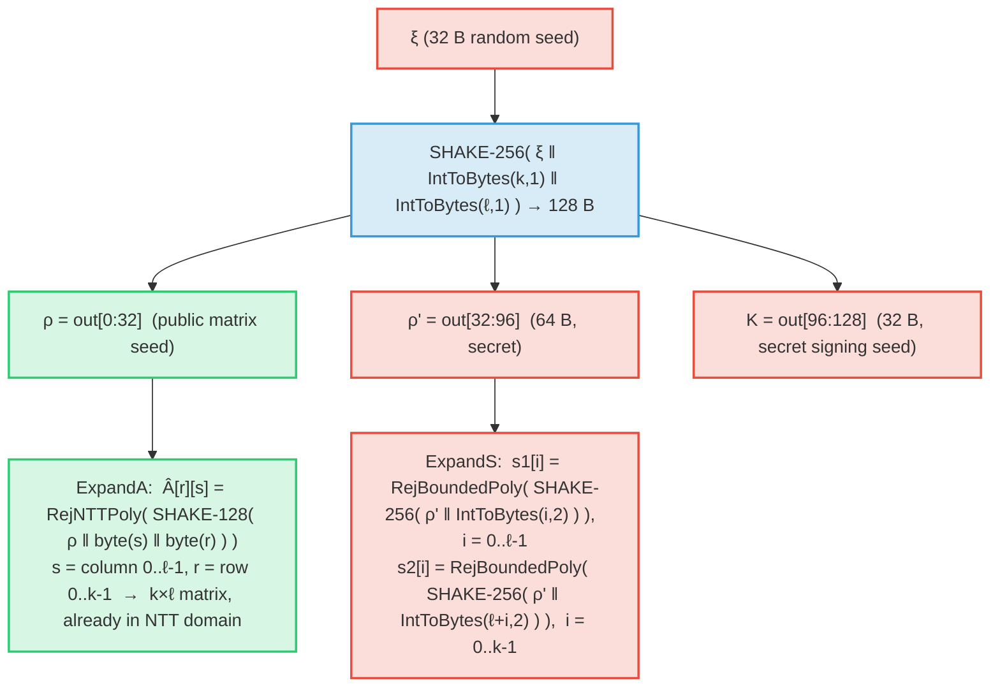

The domain-separation tags: `IntToBytes(k,1)‖IntToBytes(ℓ,1)` separates *parameter sets*; the column/row
bytes `(s,r)` separate the `k·ℓ` matrix polynomials; the 16-bit little-endian nonce `IntToBytes(i,2)`
(running `0..ℓ-1` for `s1`, then `ℓ..ℓ+k-1` for `s2`) separates the `ℓ+k` secret polynomials. Go:
`KeyGenP` → `expandAP`/`ExpandA`, `expandSP`/`rejBoundedPolyP` (the masking nonce reuses the same idea:
`expandMaskP` tags with the 16-bit counter `κ+r`).

#### 2.1.2 Finer detail — the key `t = A·s1 + s2` in the NTT domain

`A` is produced *already in the NTT domain* (`Â`), so the matrix–vector product is a pointwise
multiply-accumulate, with one inverse transform before adding `s2`:

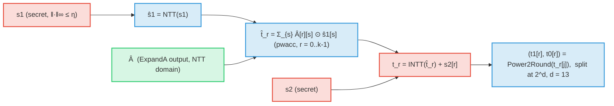

This `NTT → ⊙-accumulate → INTT` pattern (Go `ntt`/`pwacc`/`intt`, §1) is the *same* arithmetic used in Sign
(`A·y`, `c·s1`, `c·s2`, `c·t0`) and Verify (`A·z`, `c·t1·2^d`); it is drawn once here and referenced
elsewhere. `⊙` is coefficient-wise multiply in the NTT domain.

#### 2.1.3 Finer detail — `pkEncode` / `skEncode` byte layout

The keys are bit-packed (LSB-first); the byte offsets below are for **ML-DSA-87** (`k=8, ℓ=7, η=2, d=13`),
with the general formula in each row. `bη = bitlen(2η)` = 3 for `η=2` (-44/-87), 4 for `η=4` (-65).

**`pk` — `pkEncode(ρ, t1)`, total `32 + k·(256·10/8)` = 2592 B:**

| offset | size (B) | field | encoding |
|---|---|---|---|
| 0 | 32 | `ρ` | raw matrix seed |
| 32 | `k·320` (2560) | `t1` | `pack(t1[r], 10 bits)`, `r = 0..k-1` (10 = `bitlen(q-1) − d`) |

**`sk` — `skEncode(ρ, K, tr, s1, s2, t0)`, total `128 + (ℓ+k)·(256·bη/8) + k·(256·13/8)` = 4896 B:**

| offset | size (B) | field | encoding |
|---|---|---|---|
| 0 | 32 | `ρ` | raw |
| 32 | 32 | `K` | raw signing seed |
| 64 | 64 | `tr = H(pk)` | binds `sk` to its `pk` |
| 128 | `ℓ·(256·bη/8)` (672) | `s1` | `pack(η − s1[i], bη bits)` |
| 800 | `k·(256·bη/8)` (768) | `s2` | `pack(η − s2[i], bη bits)` |
| 1568 | `k·(256·13/8)` (3328) | `t0` | `pack(2^(d-1) − t0[i], 13 bits)` |

(The signature `σ` is analogously `sigEncode(c̃, z, h)` = `c̃` ‖ `pack(γ1 − z, 1+bitlen(γ1−1))` ‖
hint-run-length encoding — see §2.2 and §2.4.) Go: `PkEncode`/`pkEncodeP`, `SkDecode` (the codec; encode is
inline in `KeyGenP`), `SigEncode`/`sigEncodeP`, `hintPack`. The derived sizes are asserted against CIRCL in
`params_selfcheck_test.go`.

### 2.2 Sign — Fiat–Shamir **with aborts** (Algorithm 7)

This is the only place with an intentional **data-dependent loop** (the rejection sampler). It is drawn
explicitly:

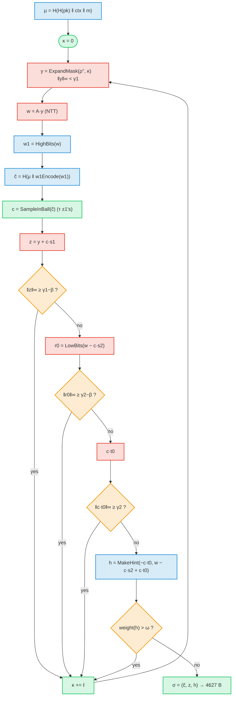

**🔒 Security.** The accepted `z = y + c·s1` is **perfectly masked**: conditioned on acceptance it is uniform
on its norm window, *independent of the secret shift `c·s1`*. This perfect-HVZK property is the heart of the
EUF-CMA proof and is now **machine-checked from first principles** — the rejection-sampling
change-of-variables `reject_uniform` / `masking_perfect_concrete` (`ml_adsa_masking.ec`), resting only on
`0 ≤ β ≤ γ1−1`. Go: `SignP` (`sign_param.go`).

**🛡 Side-channel.** The four amber checks (`‖z‖`, `‖r0‖`, `‖c·t0‖`, hint weight) **abort the attempt** — the
*number of attempts* is secret-dependent (inherent to FS-with-aborts). Two mitigations:
(1) the magnitude comparisons use the **branchless centered absolute value** `cabs` (a constant-time select,
not a data branch — `mldsa87.go`); (2) ML-ADSA's deployment uses **deterministic nonces** and a combiner
that **abstains on a *public* norm sum** (§3), so the loop-count surface is removed from the aggregate path.
The automated screen for this is the dudect Welch t-test harness (`ct_test.go`, `docs/34 §2c`).

### 2.3 Verify (Algorithm 8) — no secrets at all


**🔒 Security.** Verify recomputes the challenge from `w'₁` and checks it matches `c̃`. A forgery requires a
SelfTargetMSIS solution. Go: `Verify` (`mldsa87.go`); the length/range guards (audit H1/H2/H3) make it
**panic-free on adversarial input** — important because in consensus a panic is a remote-DoS primitive.

**🛡 Side-channel.** Verify touches **no secret**, so all of its branches (amber) are on public data and are
free. The same code is the ML-ADSA verifier — the aggregate *is* a FIPS-204 signature.

### 2.4 FIPS-204 step ↔ diagram ↔ Go-symbol traceability

Each algorithm step maps to a FIPS-204 sub-routine (algorithm number) and a reference-code symbol, so the
faithfulness of the diagrams is checkable line-by-line. (`*P` symbols are the parameter-generic forms in
`verify_param.go`/`sign_param.go`; the un-suffixed forms are the -87 reference in `mldsa87.go`. The two are
asserted equal for -87.)

**KeyGen** (FIPS-204 Alg 1 / 6, `KeyGenP`):

| Step | FIPS-204 | Diagram | Go symbol |
|---|---|---|---|
| `(ρ,ρ',K) ← H(ξ‖k‖ℓ)` | Alg 6 | §2.1, §2.1.1 | `KeyGenP` |
| `Â ← ExpandA(ρ)` | Alg 32 | §2.1.1 | `expandAP` / `ExpandA` |
| `(s1,s2) ← ExpandS(ρ')` | Alg 33 | §2.1.1 | `expandSP` / `rejBoundedPolyP` |
| `t = INTT(Â∘NTT(s1)) + s2` | Alg 41/42 | §1, §2.1.2 | `ntt` / `pwacc` / `intt` |
| `(t1,t0) = Power2Round(t)` | Alg 35 | §2.1, §2.1.2 | `power2round` |
| `pk = pkEncode(ρ,t1)` | Alg 22 | §2.1.3 | `pkEncodeP` / `PkEncode` |
| `sk = skEncode(…, tr=H(pk))` | Alg 24 | §2.1.3 | `KeyGenP` / `SkDecode` codec |

**Sign** (FIPS-204 Alg 2 / 7, `SignP`):

| Step | FIPS-204 | Diagram | Go symbol |
|---|---|---|---|
| `μ = H(H(pk)‖ctx‖m)` | Alg 2 | §2.2 | `computeMu` |
| `y = ExpandMask(ρ'',κ)` | Alg 34 | §2.2 | `expandMaskP` |
| `w = A·y`; `w1 = HighBits(w)` | Alg 41, 37/36 | §2.2 | `ntt`/`intt`, `highbitsP`/`decomposeP` |
| `c̃ = H(μ‖w1Encode(w1))` | Alg 28 | §2.2 | `w1EncodeP`/`w1Encode`, `shake256` |
| `c = SampleInBall(c̃)` | Alg 29 | §2.2 | `sampleInBallP` / `SampleInBall` |
| `z = y + c·s1`; `‖z‖∞ < γ1−β` | Alg 7 | §2.2 | `padd`, `maxAbsVec` |
| `r0 = LowBits(w−c·s2)`; bound | Alg 38 | §2.2 | `lowbitsP` |
| `h = MakeHint(−c·t0, …)`; `wt ≤ ω` | Alg 39 | §2.2 | `makeHintP` |
| `σ = sigEncode(c̃,z,h)` | Alg 26 | §2.2, §2.1.3 | `sigEncodeP` / `SigEncode`, `hintPack` |

**Verify** (FIPS-204 Alg 3 / 8, `Verify`):

| Step | FIPS-204 | Diagram | Go symbol |
|---|---|---|---|
| decode `pk`, `σ`; length guard | Alg 23, 27 | §2.3 | `PkDecode`, `SigDecode`, `Verify` |
| bound `‖z‖∞`, hint weight `≤ ω` | Alg 8 | §2.3 | `cabs`, weight loop in `Verify` |
| `Â = ExpandA(ρ)`; `c = SampleInBall(c̃)` | Alg 32, 29 | §2.3 | `ExpandA`, `SampleInBall` |
| `w'1 = UseHint(h, A·z − c·t1·2^d)` | Alg 40, 41/42 | §2.3 | `useHintP`/`useHint`, `ntt`/`intt` |
| `c̃' = H(μ‖w1Encode(w'1))`; compare | Alg 28 | §2.3 | `computeMu`, `w1Encode`, `Verify` |

---

## 3. ML-ADSA end-to-end

### 3.1 The one-line idea: the additive dual of BLS

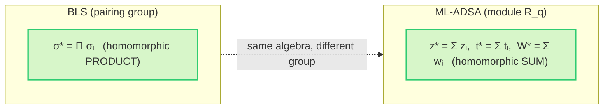

Aggregation is literally **addition in `R_q`**. The summed key `t* = Σ tᵢ` is itself a bona-fide ML-DSA key
(a sum of MLWE samples is an MLWE sample), and `z* = Σ zᵢ = (Σ yᵢ) + c̃*·(Σ s1ᵢ)` is the response of a single
signer holding that key — so `σ* = (c̃*, z*, h*)` verifies under the **unmodified** FIPS-204 verifier.

### 3.2 The non-interactive combine — no coordinator, no challenge sent, one broadcast per signer

> **This is _not_ an interactive (MuSig-style) handshake.** There is no aggregator that collects nonce
> commitments, replies with a challenge, and then gathers responses across rounds. Non-interactivity comes
> from three facts, and it is important to draw it that way:
>
> 1. **Deterministic nonces.** `y_i = DeriveNonce(msk_i, C)` — so each commitment `w_i = A·y_i` is fixed by
>    `(key_i, content C)` and is **pre-published** alongside `t_i` in the epoch key-tree / commitment pool,
>    in bulk, ahead of time. It is *not* a per-signature interactive "round 1."
> 2. **Self-derived challenge.** Every signer **computes `c*` itself** from the public cohort commitments
>    `{w_j}` (`c* = H(μ ‖ HighBits(W*))`). **Nobody sends a challenge.**
> 3. **Single broadcast.** Each signer therefore emits its response `z_i` as **one** message (exactly like a
>    BLS attestation gossip), and **any untrusted party just sums** `{t_j, w_j, z_j}` into `σ*`.

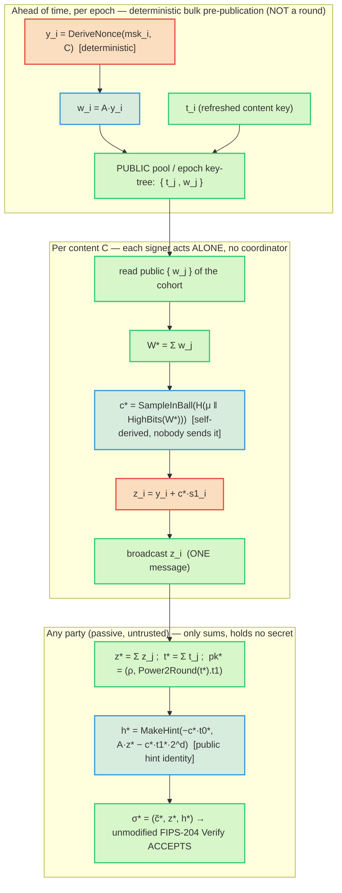

**On "two rounds."** There *is* a logical data dependency — `c*` depends on `W* = Σ w_j`, so commitments
must exist before responses (this is the Fiat–Shamir binding, and exactly why finished aggregates are
*homomorphic but not freely mergeable*). But that dependency is satisfied by **deterministic
pre-publication**, not by an interactive exchange: no signer waits on a message *from* another signer or
*from* a coordinator, and no challenge is ever transmitted. The earlier framing of this as an
aggregator-driven "round 1 / round 2" would describe the interactive MuSig design that ML-ADSA explicitly is
**not** (see [[ml-adsa-noninteractive]]). The deeper question — *how* each signer derives the shared `c*` and
responds without ever knowing another signer's nonce — is answered in **§6** ("Why signers can aggregate
independently without knowing each other's nonces"): they coordinate on the **public, per-message one-time**
commitments `wⱼ`, never on the private nonces `yⱼ` — and the freshness of each per-message key (not any
hiding of `wⱼ`) is what makes that safe.

**🔓 Why publishing the full `wᵢ` is safe (the central point).** In ML-ADSA we *deliberately* publish the
full per-signer commitment `wᵢ = A·yᵢ` — single-key ML-DSA never does this (its verifier recomputes `w`). An
observer **can** invert it: `A` is tall (`k ≥ ℓ`, full column rank), so `wᵢ = A·yᵢ` has a *unique* preimage
and `yᵢ` is recovered by plain linear algebra (`ŷ = Â⁺ŵ` per NTT slot) — it is **not** Module-SIS-hidden.
Together with the public `zᵢ = yᵢ + c*·s1ᵢ` that also hands the attacker that round's per-content secret key
`s1ᵢ,C = c*⁻¹(zᵢ − yᵢ)`. **This is harmless**, and not because of generic HVZK hand-waving: each content uses
a *fresh, independent* key **and** nonce, both PRF-derived from the master seed + the **message-bound**
content label (`ContentKeyDerive`/`DeriveNonce`), and each such key is used **exactly once**. So the recovered
material is a *spent, single-use* key for an **already-signed** message; an EUF-CMA forgery must target a
**fresh** message `m*`, whose key is an independent PRF output the signer never used — never published, never
exposed. Recovering a signed message's key reveals nothing toward any other message (the PRF refresh
firewall). This is the core of the **F-C4 many-time** argument, machine-checked as a four-hop reduction —
**transcript ≤ key-leak** (`transcript_le_keyleak`) → **PRF refresh** (`= adv_prf`) → **clean un-queried
`Q`-target** → **lattice hardness** (`eq_exact` → MLWE + SelfTargetMSIS), giving
`Pr[forge] ≤ adv_prf + Q·(adv_mlwe + Pr[STMSIS])`. The full table (published vs recoverable vs protected),
the step-by-step four hops, and the message-binding fix that keeps `pk*_C` single-purpose are in **§6**
("Why the nonce `y` must be secret *while in use*…" and "Machine-checked: the deployed (public-`wᵢ`)
security").

**🔒 Security.** The self-derived `c*` binds the **entire** commitment `W*`, which is exactly what defeats the
Drijvers/ROS attack — giving concurrent security with **no ROS/AGM/OMDL assumption**
(`unbiasable_challenge`, `challenge_adversary_independent`; paper §6.4). Determinism + the public,
predictable content `C = (slot, committee)` also enforces the one-time discipline (fixed cohort ⇒ fixed `c*`
⇒ no nonce reuse). Go: the reference combine is `AggregateF` (`construction_f.go`) and the parameterized
`AggregateP` (`aggregate_param.go`); the per-node **decentralized** combine over public broadcasts is
`CombineFromPublic` (qrysm `mladsa/decentralized.go`), asserted byte-identical to `AggregateF` by
`TestDecentralized_EqualsAggregateF`.

**🛡 Side-channel.** The only secret-touching step is each signer's **local** `z_i = y_i + c*·s1_i` (the §2.2
constant-time path); the published `z_i` is HVZK-simulatable, so broadcasting it leaks nothing. The summing
party runs **entirely on public data** — `t_j, w_j, z_j` are public, and `rr2 = A·z* − c*·t1*·2^d` is the
public hint identity (computed *without* `s2*`). Its only branch — **ABSTAIN** when `‖z*‖∞ ≥ γ1−β` — is a
test on a **public sum**, so it leaks nothing and needs no resampling round.

### 3.3 The layered construction (L0–L3)

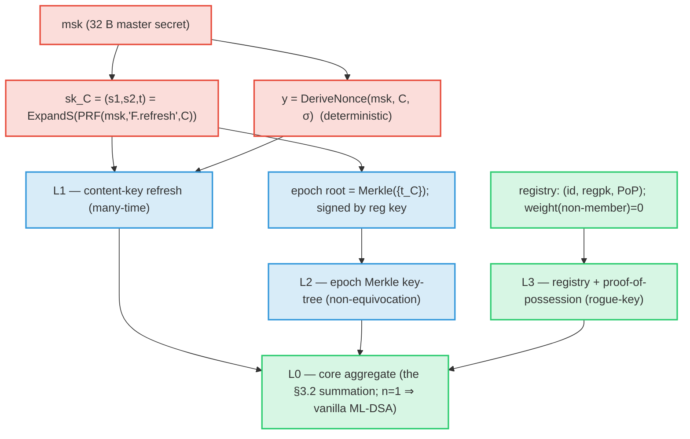

- **L1 (many-time).** Distinct contents `C` give independent keys (PRF security), so aggregating across many
  contents is safe and per-content security equals single ML-DSA (`ml_adsa_F_manytime.ec`,
  `ml_adsa_F_refresh.ec`). Nonces are **deterministic** — no per-signature RNG — subject to the **one-time
  discipline**: a `(signer, C)` signs at most once (enforced by `DurableOneTimeGuard`, fsync'd, write-ahead).
- **L2 (non-equivocation, properties F-C8/C9).** A `t_C` is accepted only if it is a proven member of a
  registration-signed epoch root. Go: `EpochKeyTreeBuild` + `(EpochKeyTree).PathFor` + `MerkleVerify`
  (`construction_f.go`, `merkle.go`), checked in aggregation by `ProvenanceVerifyF`; proofs: Coq
  `ml_adsa_F_provenance.v` and Gobra `merkleBinding`. ("VerifyEpochRoot"/"VerifyContentInTree" are the
  *prose* names for these checks in the spec, not Go symbols.)
- **L3 (rogue-key).** Recognized weight comes from the public registry + PoP; non-registered signers
  (decoys) have weight 0 and **cannot change outcomes** (`ml_adsa_rogue_proof.ec`, Coq
  `ml_adsa_F_decisions.v`, Gobra `filterRecognized`).

**🛡 Side-channel.** `msk` and the refreshed `sk_C`/nonce are the only long-lived secrets; they feed the
deterministic PRF (constant work) and then the §2.2 signer path. The one-time guard prevents the *one* fatal
leak of deterministic signing (two responses under the same nonce ⇒ key recovery) — see
[[deterministic-nonce-security]].

### 3.4 The whole flow with 1, 2, 3, … N signers

Two views of the *same* process across an `N`-signer cohort. The **temporal** view reads top-to-bottom as
time; the **structural** view reads left-to-right as data flow. (Remember §3.2: this is non-interactive —
commitments are deterministic and pre-published, each signer self-derives `c*`, and the summing party is
passive. No one sends a challenge.)

**Temporal — steps in time (each signer acts on its own; the pool is a passive medium):**

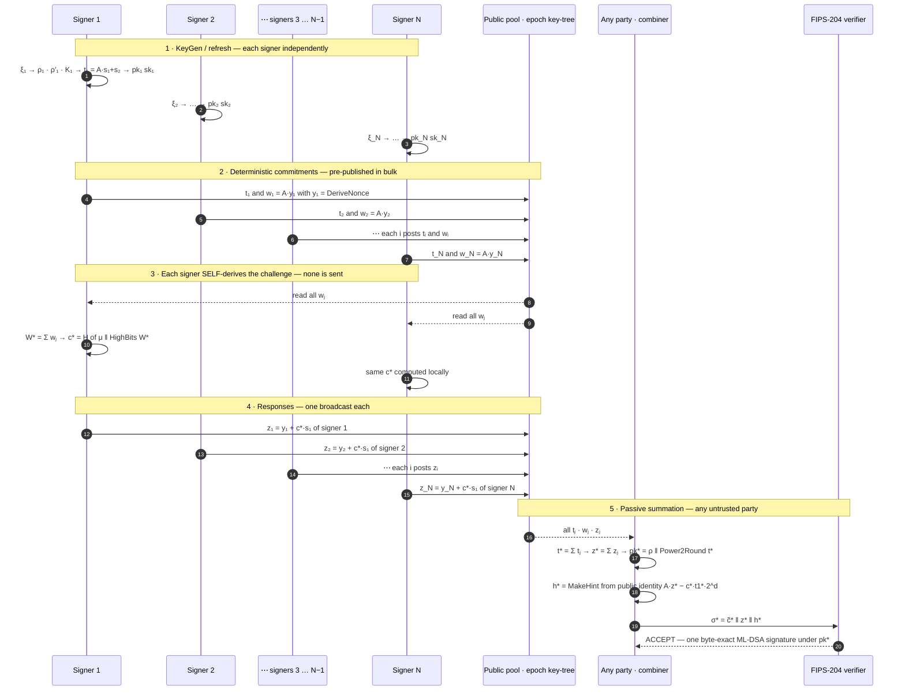

**Structural — all parties and steps at once (data flow left-to-right):**

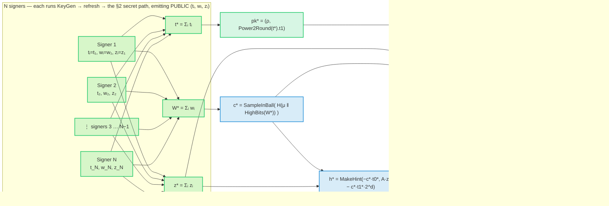

Both views show the **constant-size** payoff: no matter how large `N` grows, the sums `t*, W*, z*` and the
final `σ*` stay one ML-DSA-87 object (2592 B key, 4627 B signature) — the only `N`-dependent datum is the
public participation bitmap. Each signer's secret work (the red path of §2.2) happens **locally** before it
emits its public `(tᵢ, wᵢ, zᵢ)`; everything drawn here downstream of the broadcasts is public.

---

## 4. Security guarantees — the reduction chains

### 4.1 EUF-CMA (ROM keystone)

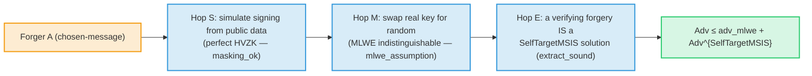

Machine-checked, admit-free: `msufcma_uncond` (`ml_adsa_euf.ec`). **SUF-CMA** adds the same-`(μ,c)`-new-`(z,h)`
collision term, bundled as `StrongSIS = SelfTargetMSIS ∨ Module-SIS` (`sufcma_uncond`, `ml_adsa_suf.ec`).

### 4.2 QROM (post-quantum) and equivalence-class hardness

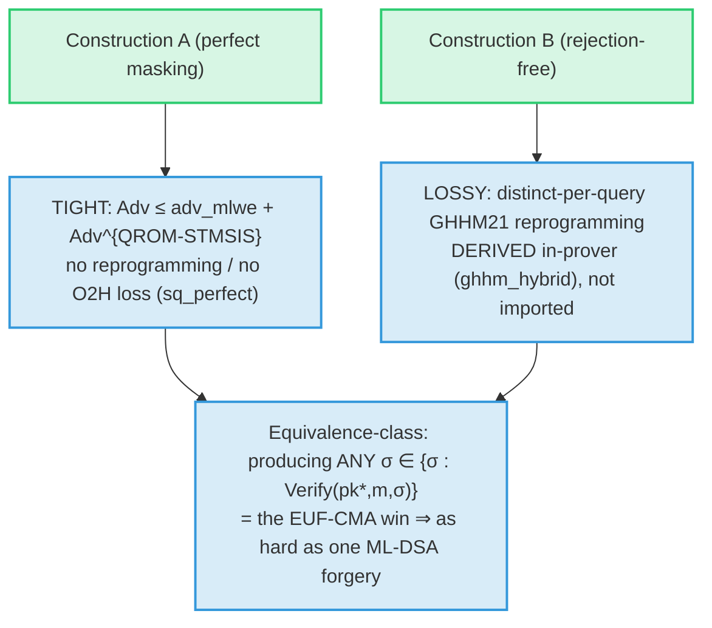

`qrom_eufcma_uncond` (A, tight), `qrom_eufcma_lossy` + `ml_adsa_qrom_ghhm.ec` (B, derived bound),
`equiv_class_guess_bound` / `qrom_equiv_class_uncond` (multiplicity gives no advantage). All inherit the
**parameter set's** NIST category — 2/3/5 for ML-ADSA-44/65/87 (the proofs quantify over `(k,ℓ,η,τ,γ,ω)`).

### 4.3 Which assumption guards which step

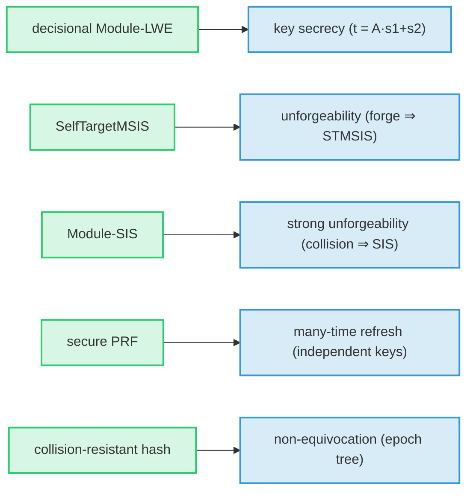

These are **exactly ML-DSA's own assumptions** — ML-ADSA adds no new hardness assumption.

---

## 5. Side-channel & leak-freedom — how it is guaranteed

The constant-time goal: **no secret value influences a branch, a memory-access pattern, or instruction
timing.** The posture and its evidence are in `docs/34 §2`; here is the picture.

### 5.1 The secret-data-flow map

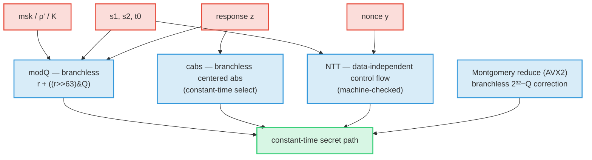

Every red→blue edge is an operation on a secret, and every blue node is **branchless / data-independent**.

### 5.2 Branchless reductions (the pattern, before → after)

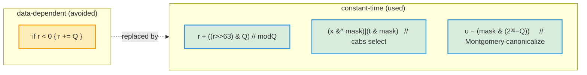

> Honest note: Go's compiler often lowers a naive `if r<0 { r+=Q }` to a branchless `cmov` anyway — which is
> *why* the dudect positive control had to use a data-dependent **loop count**, not a sign test, to register
> leakage (`ct_test.go`). The code uses the explicit branchless forms regardless, so the property does not
> depend on a compiler optimization (`docs/34 §2b`).

### 5.3 The NTT data-independence — as a proof obligation

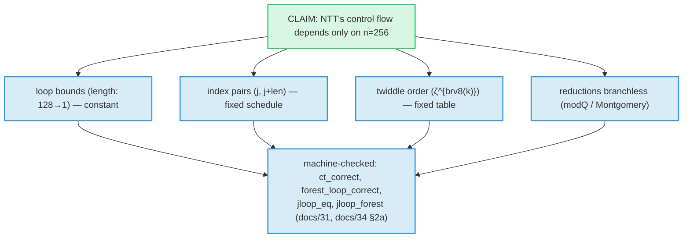

This is stronger than "we wrote it carefully": the iterative loop the code runs is *proved equal* to the
recursion, with termination, and the literal `a[j]`/`a[j+len]` index arithmetic is checked — so the
data-independence is a theorem, not a comment.

### 5.4 The validation pipeline (defense in depth)

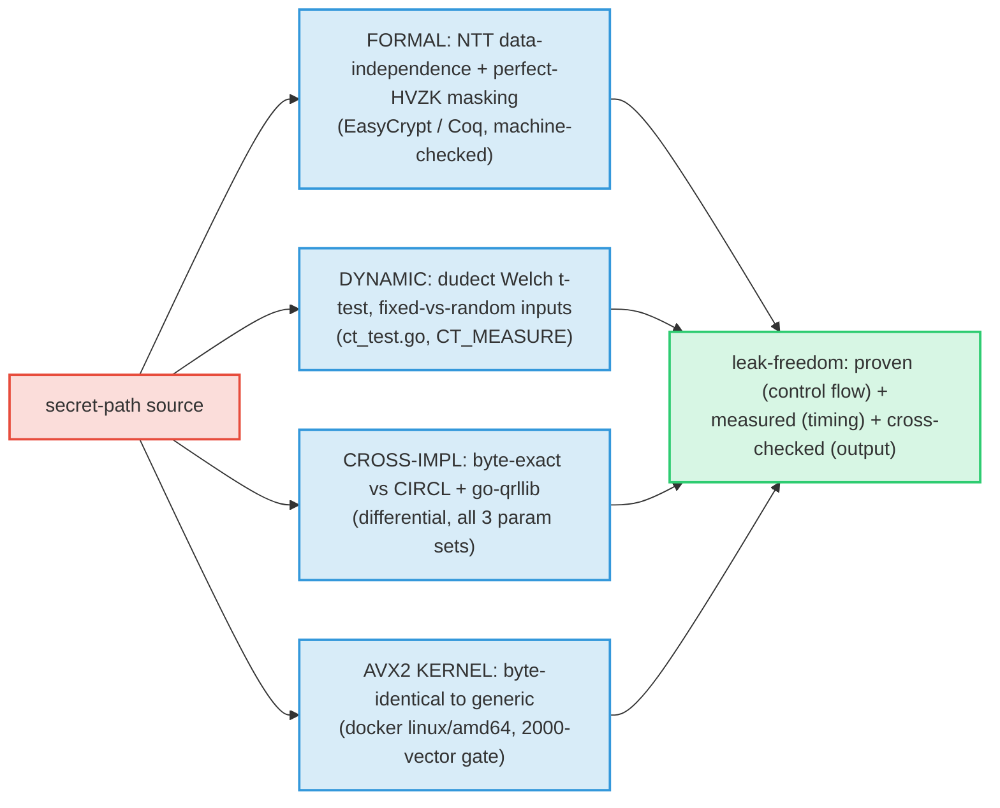

### 5.5 Constant-time checklist (decision view)

```mermaid
flowchart TD
  q0{"Does the op touch a SECRET?"}:::danger
  q1{"Branch / loop count<br/>depends on the secret?"}:::danger
  q2{"Memory access index<br/>depends on the secret?"}:::danger
  q3{"Variable-latency instr<br/>on secret (div/mod)?"}:::danger
  okp(["free — public data"]):::public
  fix1["→ branchless select / masking (modQ, cabs)"]:::derived
  fix2["→ data-independent schedule (NTT), or<br/>determinism + public-sum abstain (aggregate)"]:::derived
  fix3["→ Montgomery/branchless reduction (no %Q on secret)"]:::derived
  ct(["CONSTANT-TIME ✓"]):::public
  q0 -- no --> okp
  q0 -- yes --> q1
  q1 -- yes --> fix1 --> ct
  q1 -- no --> q2
  q2 -- yes --> fix2 --> ct
  q2 -- no --> q3
  q3 -- yes --> fix3 --> ct
  q3 -- no --> ct
  classDef danger fill:#f39c1230,stroke:#f39c12,stroke-width:2px;
  classDef public fill:#2ecc7130,stroke:#2ecc71,stroke-width:2px;
  classDef derived fill:#3498db30,stroke:#3498db,stroke-width:2px;
```

**Honest residual.** The one inherently data-dependent element is the **rejection-loop attempt count** in
single-signer signing (§2.2) — universal to Fiat–Shamir-with-aborts. ML-ADSA's deployment removes it from
the *aggregate* path (deterministic nonces + abstain on the *public* sum), and a fully hardened
single-signer build (constant-time sampler, masking) is the remaining engineering item (`docs/34 §2`,
`docs/32 #7`). Microarchitectural leakage on native silicon (`dudect`/`ctgrind` on x86) is a deployment-time
validation step, not yet run on hardware here.

---

## 6. The secrets-handling contract — public vs private, randomness, constant-time, zeroization

This section leaves **nothing to guess**: for every value, whether it is public or private, whether it must
be unpredictable, whether the code touching it must be constant-time, and whether its buffer must be
zeroized. Read it before deploying.

### The trust boundary at a glance

There are **three** tiers, not two — the middle one is the subtle part:

```mermaid
flowchart TB
  subgraph PRIV["PERMANENTLY PRIVATE — never leaks, ever · constant-time · ZEROIZE"]
    direction LR
    p1["root seeds<br/>ξ · msk · regsk · ρ′ · K"]:::secret
    p5["long-term s1·s2·t0 (standalone ML-DSA)<br/>and every NOT-YET-signed content's key (ML-ADSA, PRF firewall)"]:::secret
  end
  subgraph ONETIME["1-TIME — secret WHILE signing, effectively PUBLIC once that content is signed (harmless: never reused)"]
    direction LR
    p3["per-content nonce & key<br/>y_C · s1_C · s2_C · t0_C"]:::danger
    p4["round transients<br/>c·s1 · c·s2 · c·t0 · w · r0"]:::danger
  end
  subgraph PUBL["PUBLIC — safe to publish · branch freely · no zeroization"]
    direction LR
    u1["keys<br/>ρ · t1 · pk · pk*"]:::public
    u2["signature parts<br/>c̃ · c · z · h · σ · σ*"]:::public
    u3["ML-ADSA contributions<br/>tᵢ · wᵢ · zᵢ · t* · W* · z* · c*"]:::public
    u4["derived public<br/>μ · tr · epoch root · registry · PoP"]:::derived
  end
  PRIV ==>|"PRF firewall: derive one-time keys from msk —<br/>NEVER the reverse"| ONETIME
  ONETIME ==>|"signing publishes wᵢ, zᵢ ⇒ that content's<br/>one-time key becomes recoverable (harmless: spent)"| PUBL
  classDef secret fill:#e74c3c30,stroke:#e74c3c,stroke-width:2px;
  classDef public fill:#2ecc7130,stroke:#2ecc71,stroke-width:2px;
  classDef derived fill:#3498db30,stroke:#3498db,stroke-width:2px;
  classDef danger fill:#f39c1230,stroke:#f39c12,stroke-width:2px;
```

The amber **1-TIME** tier is the honest status of ML-ADSA's per-content nonce/key: secret *while* a round is
live, then effectively public once it is signed (since `wᵢ` is published and `A` is tall). It is *not* a leak
that matters, because each such value is used exactly once. Only the red **permanent** tier — `msk`/`regsk`
and every unsigned content's key — must stay secret across all future signatures.

### Classification table — ML-DSA

Legend: **Class** = PUBLIC / PRIVATE; **Rand?** = must be unpredictable (sampled or PRF-derived);
**CT?** = the code reading it must be constant-time; **Zero?** = the buffer must be zeroized after use.

| Value | Lives in | Class | Rand? | CT? | Zero? |
|---|---|---|:---:|:---:|:---:|
| `ξ` — keygen seed (32 B) | transient | **PRIVATE** | **YES** (CSPRNG) | yes | **YES** |
| `ρ` — matrix seed (32 B) | `pk`, `sk` | PUBLIC | no | no | no |
| `ρ′` — secret seed (64 B) | `sk` | **PRIVATE** | derived | yes | **YES** |
| `K` — signing seed (32 B) | `sk` | **PRIVATE** | derived | yes | **YES** |
| `s1, s2` — secret vectors | `sk` | **PRIVATE** | derived | **YES** | **YES** |
| `t1` — high bits of `t` | `pk`, `sk` | PUBLIC | no | no | no |
| `t0` — low bits of `t` | `sk` | **PRIVATE** | derived | yes | **YES** |
| `tr = H(pk)` (64 B) | `sk` (cache) | PUBLIC | no | no | no (recomputable) |
| `μ = H(tr‖M′)` | transient | PUBLIC (derived) | no | no | no |
| `y` — masking nonce | transient | **PRIVATE** | **YES** (one-time) | **YES** | **YES** |
| `w = Ay`, `w1` — commitment | transient | **PRIVATE** ¹ | no | **YES** | **YES** |
| `c̃` — challenge hash | `σ` | PUBLIC | no | no | no |
| `c = SampleInBall(c̃)` | transient | PUBLIC | no | no | no |
| `c·s1, c·s2, c·t0, r0` | transient | **PRIVATE** | no | **YES** | **YES** |
| `z = y + c·s1` — response | `σ` | PUBLIC ² | no | (compute CT) | no |
| `h` — hint | `σ` | PUBLIC | no | no | no |
| `pk` | published | PUBLIC | no | no | no |
| `sk` (whole) | stored | **PRIVATE** | — | yes | **YES** |
| `σ = (c̃, z, h)` | published | PUBLIC | no | no | no |

¹ In **ML-DSA**, `w`/`w1` are *internal* (never published) and depend on the secret `y`, so treat them as
secret. In **ML-ADSA**, the per-signer `wᵢ` *is* published — that is HVZK-safe by design (it reveals nothing
usable), which is why it moves to PUBLIC in the next table. ² `z` is **published only after** rejection
sampling makes it independent of `s1` (perfect HVZK); its *computation* touches secrets and must be
constant-time, but the released value is public and need not be hidden or zeroized.

### Classification table — ML-ADSA additions

| Value | Lives in | Class | Rand? | CT? | Zero? |
|---|---|---|:---:|:---:|:---:|
| `msk` — master seed (32 B) | signer | **PRIVATE (permanent)** | **YES** (CSPRNG) | yes | **YES** |
| `regsk` — registration key | signer | **PRIVATE (permanent)** | yes | yes | **YES** |
| `sk_C = (s1,s2,t0)` per content | transient | **1-TIME** ¹ | **YES** (PRF) | **YES** | yes (until published) |
| `yᵢ = DeriveNonce(msk,C)` | transient | **1-TIME** ¹ | **YES** (PRF, one-time) | **YES** | yes (until published) |
| `tᵢ` — content key | epoch tree, pool | PUBLIC | no | no | no |
| `wᵢ = A·yᵢ` — commitment | pool | PUBLIC | no | no | no |
| `zᵢ` — response | broadcast | PUBLIC | no | no | no |
| `t*, W*, z*` — sums | derivable | PUBLIC | no | no | no |
| `pk* = (ρ, t1*)` | derivable | PUBLIC | no | no | no |
| `c* = H(μ‖HighBits(W*))` | derivable | PUBLIC | no | no | no |
| `σ* = (c̃*, z*, h*)` | published | PUBLIC | no | no | no |
| epoch root, registry, PoP, `regpk` | published | PUBLIC | no | no | no |
| one-time guard state (used-set) | durable store | not secret — **INTEGRITY-CRITICAL** | n/a | n/a | **must persist** |

¹ **"1-TIME" is a third tier between PRIVATE and PUBLIC, and the distinction is load-bearing.** Because
ML-ADSA publishes `wᵢ`, a per-content one-time value is **secret only while the round is in progress** and
becomes **effectively public once content `C` is signed**: `A` is tall, so `wᵢ = A·yᵢ` reveals `yᵢ`, and then
`zᵢ` reveals `s1_C` (and `tᵢ` reveals `s2_C`, `t0_C`). So `yᵢ`/`sk_C` are **not** permanently private the way
they are in *standalone* ML-DSA (where `w` is never published). That is harmless solely because they are
**one-time** — each is used at most once (refresh + the durable guard), so its post-signing disclosure
unlocks nothing reusable. The **only permanently-private** secrets are `msk`/`regsk` and, through them, *every
not-yet-signed content's key* (an independent PRF output that stays permanently-private until it too is spent
into the 1-TIME tier by being signed). CT/zeroize still apply *during* a round (the value is genuinely secret
until `zᵢ` is published); after that they are moot because the value is public anyway. See "Why the nonce `y`
is private…" above for the forgery analysis — and note its title is, strictly, *"secret while in use."*

### Randomness — what must be unpredictable, and what must never repeat

> **Only the root seeds are sampled.** Exactly the keygen seed `ξ` (ML-DSA) and the master seed `msk` (plus
> `regsk`) come from a **CSPRNG**; everything else is *deterministically derived*. A weak/biased RNG here is a
> full key compromise.
>
> **Nonces are deterministic but must stay unpredictable *and* one-time.** `y` / `yᵢ` are PRF outputs (not
> fresh randomness), so they are reproducible by the secret holder — but they must be (a) unpredictable to an
> attacker (PRF security) and (b) **never reused for a different message under the same key**. Two responses
> sharing a nonce under two challenges give two linear equations in `s1` ⇒ **secret recovery**.
>
> **Public hashes are not secrets.** `c̃`, `c`, `μ` are fully determined and public; there is nothing random
> to protect about them.

### Why the nonce `y` must be secret *while in use* — and why publishing `wᵢ = A·yᵢ` afterward is safe

The nonce blinds the signing key during a round, so its handling deserves a precise statement. Note up front
(this is the corrected framing): in ML-ADSA `y` is **not permanently private** — publishing `wᵢ = A·yᵢ` makes
it recoverable, so it is a **one-time ephemeral**: secret *while the round is live*, effectively *public
afterward*. What must be protected is its **secrecy during the round** and its **one-time use**, not its
secrecy forever.

- **Leaking `y` even once recovers the whole key.** The response `z = y + c·s1` is public and the challenge
  `c` is public. Anyone who learns `y` computes `c·s1 = z − y`; since `c` is (with overwhelming probability)
  invertible in `R_q`, that gives `s1`, and then `s2 = t − A·s1` — the **entire secret key, from a single
  signature**. So `y` must never be transmitted, logged, swapped to disk, or left in freed memory.
- **Predicting `y` is as bad as leaking it.** A guessable or biased `y` enables the same `z − y` recovery —
  hence `y` must be *unpredictable*, even though here it is *deterministic* (a PRF output reproducible only
  by the secret holder).
- **Reusing `y` recovers the key.** `z = y + c·s1` and `z′ = y + c′·s1` give `z − z′ = (c − c′)·s1` — the
  lattice analogue of ECDSA `k`-reuse. This is what the one-time rule below prevents.
- **Publishing `wᵢ = A·yᵢ` *does* expose `yᵢ` — and the *per-message one-time refresh* is what makes that
  harmless.** Be precise (this is a subtle point worth getting right): ML-DSA's `A` is **tall/square**
  (`k ≥ ℓ`, full column rank), so `wᵢ = A·yᵢ` has a **unique** preimage — `yᵢ` is recoverable from `wᵢ` by
  plain linear algebra (`ŷ = Â⁺ŵ` per NTT slot). It is **not** hidden by Module-SIS (SIS-hardness requires a
  *wide* matrix). So an observer of the public `(wᵢ, zᵢ)` *can* recover `yᵢ` and then `s1ᵢ` — but **only the
  one-time key for the message that was already signed.** That is exactly what the **L1 content refresh**
  defends: every message `m` gets a *fresh, independent* one-time key **and** nonce, both deterministically
  PRF-derived from `m` (`ContentKeyDerive`/`DeriveNonce` — no coordinator, no interaction). An EUF-CMA
  forgery must be on a **fresh** `m*` never signed; its key `ExpandS(PRF(seed,"F.key",m*))` is an independent
  PRF output the signer never used, so its `(w, z)` were never published and it is **never exposed**.
  Recovering an already-signed message's key reveals nothing about any other message's key (PRF firewall), so
  the leak buys an attacker nothing toward a forgery. This is the F-C4 *many-time* keystone: security reduces
  to single-message ML-DSA up to `adv_prf` (`ml_adsa_F_refresh.ec`, `ml_adsa_F_manytime.ec`).

```
 PUBLIC :  wᵢ = A·yᵢ          (tall A ⇒ yᵢ IS recoverable — NOT SIS-hidden)
           zᵢ = yᵢ + c*·s1ᵢ    ⇒ an observer can recover THIS message's one-time key s1ᵢ,ₘ
 SAFE BECAUSE:  s1ᵢ,ₘ is a FRESH per-message key (PRF). A forgery needs a DIFFERENT message m*,
                whose key s1ᵢ,ₘ* is an independent PRF output never used ⇒ never published ⇒ never exposed.
 PRIVATE:  the master seed (and every unused message's key) — held by the PRF firewall.
```

**What the leak does *not* touch — no more leaky than ML-DSA-87 itself.** This is the load-bearing point:
recovering a finished round's one-time `(yᵢ,C, s1ᵢ,C, s2ᵢ,C)` compromises *only* content `C`'s key — which is
already signed and never reused — and reaches **neither** thing that matters for any future signature:

- **The master seed `msk` is untouched.** `s1ᵢ,C = ExpandS(PRF(msk,"F.key",C))`. Recovering `msk` from
  `s1ᵢ,C` would require inverting both `ExpandS`/SHAKE (preimage-resistant) *and* the keyed PRF (one-way); and
  by PRF security, even **arbitrarily many** recovered one-time keys across many signed contents reveal
  nothing about `msk`.
- **Every other / future content's key is untouched.** `s1ᵢ,C'` for `C' ≠ C` is an *independent* PRF output;
  it was never used, so its `(w, z)` were never published, so it is never exposed — and it is uncorrelated
  with `s1ᵢ,C` (the no-leakage tests measure this empirically: cross-content `max|corr| ≈` the noise floor).

So the secret material that governs **all future signatures** — `msk` and every not-yet-signed message's key
— is protected by *exactly* ML-DSA's own primitives: Module-LWE for each content key's secrecy, plus the same
SHAKE-based PRF ML-DSA already uses (no new assumption). The `wᵢ` exposure only ever surrenders a one-time key
that has *already done its single job*. **In every future case, ML-ADSA is therefore no more leaky than
ML-DSA-87** — it adds only the harmless disclosure of spent, single-use keys; it never weakens the long-term
secret or any unused key relative to baseline ML-DSA-87.

In single-key ML-DSA the commitment `w` is never published at all (the verifier recomputes it), a second
line of defense. ML-ADSA *does* publish `wᵢ` to enable non-interactive aggregation; the per-message one-time
refresh is precisely what keeps that publication safe. **The firewall requires the key/nonce to be bound to
the full message** so that the recovered per-content key `pk*_C` is *single-purpose* (one message). The
default `ConsensusAggregate` does this (content = the signing root, unique per slot/committee/**data**). A
"predictable-label" convenience variant (`ConsensusAggregateLabeled`) that keys the refresh by
`(slot, committee)` *decoupled* from the data would leave `pk*_C` multi-purpose — so the recovered key could
re-sign *different* data under the same label.

> **Shipped fix (closes internal pentest #3).** `go-mladsa/harden_binding.go` folds the message into the
> content-key derivation itself — `MsgBoundContent(baseC, ctx, payload)` ⇒ `AggregateFBound` — so `pk*_C`
> becomes a deterministic function of the message: `pk*(m₀) ≠ pk*(m₁)` under the same base label. A key
> recovered for a spent payload is therefore **not** the cohort-expected key for any other payload, so the
> cross-payload forgery never transfers. `BindingGuard` adds operational defense-in-depth (refuse a second,
> *different* message under one label; idempotent on the same message). Tested in
> `go-mladsa/harden_binding_test.go` (`TestBinding_ClosesRecoveredKeyForgery`,
> `TestBindingGuard_RefusesSecondMessage`) and re-pentested with a full real-`SignP` attack in
> `go-mladsa/pentest_test.go` (`TestPentest_BoundConstruction_RecoveredKeyDoesNotTransfer`). The guard alone
> does *not* close #3 (the forgery uses *recovered* keys, not a fresh honest signature) — the **binding**
> closes it; the guard hardens the honest path. See `docs/36` §6.7 for the full write-up.

### The commit→respond window — you can't be interrupted into a forgery

A signer publishes its commitment `wᵢ` and then, *after* seeing the cohort's `{wⱼ}` (to derive `c*`),
releases its response `zᵢ`. That gap — `wᵢ` public, `zᵢ` not yet — is the natural place to try to interrupt
or hijack a signer. Three facts close it:

1. **Nothing secret leaks until you release `zᵢ`.** The public `wᵢ` reveals only `yᵢ` (the nonce);
   recovering the key `s1ᵢ,C` needs `zᵢ` **and** `wᵢ` *together* (`s1ᵢ,C = c*⁻¹(zᵢ − yᵢ)`). So in the window
   no one can forge your contribution — and, just as important, **no one can *complete* your signature for
   you**, because producing a valid `zᵢ` requires `s1ᵢ,C`, which only you hold. If you are interrupted and
   never release `zᵢ`, there is **no signature and no leak**: abandoning a round is completely safe.
2. **The commitment is locked to the message you offered.** `wᵢ = A·DeriveNonce(seed, C)` is a
   *deterministic function of the content `C`* — not a random, message-agnostic nonce that a challenge later
   pins to a message. It is intrinsically tied to `C`, so the only signature `wᵢ` can ever take part in is
   one on `C`. Even granting a hypothetical break, **the only message forgeable from your published `wᵢ` is
   `C` — exactly the message you offered to sign.** You cannot be steered into signing something else with
   the commitment you already put out.
3. **A re-run never reuses the nonce.** If a round must be redone (the cohort changed, or a bound check
   aborts), it advances to a *fresh* content index `C'` with new `(yᵢ', s1ᵢ')` (spec N3 — *never* resample
   `y` for the same `C`), and the durable one-time guard refuses a second `zᵢ` for the same `(signer, C)`
   (N1). So an interrupt-and-retry can never coax two responses `zᵢ, zᵢ'` that share one nonce under two
   different challenges — the single event that *would* leak the key (`zᵢ − zᵢ' = (c* − c*')·s1ᵢ`).

Net: the window exposes nothing secret (1), whatever it does expose is bound to the offered message (2), and
you cannot be tricked into the nonce reuse that would actually break the key (3) — so being interrupted
mid-round is, at worst, a *liveness* event (the round simply doesn't complete), never a forgery or a leak.

### Why signers can aggregate independently without knowing each other's nonces

A common puzzle: the shared challenge `c*` depends on **every** signer's commitment, yet no signer knows
another's nonce. How can each one compute `c*` and respond, non-interactively, alone? Three facts resolve it:

1. **The challenge binds the *sum of commitments*, not the nonces:** `c* = H(μ ‖ HighBits(W*))` with
   `W* = Σⱼ wⱼ`. Every `wⱼ = A·yⱼ` is **public** (and is a *fresh, one-time, per-message* value — its `yⱼ`
   is recoverable, but harmlessly so, per the refresh argument above).
2. **Commitments are deterministic and pre-published**, so every signer (and any observer) sees the identical
   `{wⱼ}`, forms the identical `W*`, and derives the identical `c*` — **independently, with no exchange and
   no shared secret.**
3. **Each response uses only local secrets:** signer `i` computes `zᵢ = yᵢ + c*·s1ᵢ` from its own
   `(yᵢ, s1ᵢ)` and the public `c*`. It needs the others' **commitments** (public), **never** their
   **nonces** (private).

```
 what signer i must KNOW                           what signer i NEVER needs
 ──────────────────────────                        ─────────────────────────
 own private:  yᵢ , s1ᵢ                             others' yⱼ   (private to j)
 public pool:  every wⱼ  → W* = Σ wⱼ → c*           others' s1ⱼ  (private to j)
 then:         zᵢ = yᵢ + c*·s1ᵢ  → broadcast
```

Linearity then makes the parts compose: `Σⱼ wⱼ = A·(Σⱼ yⱼ)` is the commitment of the *summed* nonce, and
`Σⱼ zⱼ = (Σⱼ yⱼ) + c*·(Σⱼ s1ⱼ)` is the response for the *summed* key `t* = Σⱼ tⱼ`. The verifier reconstructs
the commitment from the aggregate via the hint and **never sees any individual nonce**. In one line: signers
coordinate on **public, pre-published, per-message-one-time commitments — not on any shared secret or
long-term state** — which decouples "agree on the shared challenge" from "expose anything reusable," giving
non-interactivity *and* aggregatability at once. (The commitments don't *hide* their nonces; the **freshness**
of each per-message key is what makes their exposure harmless — see the refresh argument above.)

### Constant-time — where it matters, and where it does **not**

**Must be constant-time** (reads a PRIVATE value):

- NTT / INTT / pointwise on `s1, s2, t0, y` and their NTT forms (`ŝ1, ŝ2, t̂0, ŷ`).
- `modQ`, `cabs`, `Decompose`/`HighBits`/`LowBits`, `Power2Round` on secret-derived values.
- the response `z = y + c·s1` and the hint inputs `−c·t0`; the secret-key sampler (`ExpandS` from `ρ′`).

**Need not be constant-time** (public-only — branch and index freely):

- **all of Verify** (it has no secret inputs at all);
- `ExpandA` (public `ρ` → public `A`);
- the **ML-ADSA combiner**: the summations `Σtᵢ/Σwᵢ/Σzᵢ`, `c*`, and the public hint identity `A·z* −
  c*·t1*·2^d` (every input is public);
- hashing / encoding / decoding of public `pk`, `σ`, `μ`, `c̃`.

**Inherent residual (documented, not a bug):** the rejection-sampling **loop count** in single-signer Sign
is data-dependent — universal to Fiat–Shamir-with-aborts. ML-ADSA's aggregate path removes it (deterministic
nonce + abstain on a **public** sum). Full posture and the dudect screen: `docs/34 §2`.

### Zeroization — wipe these buffers as soon as they are done

**Zeroize:** `ξ` (immediately after deriving `ρ,ρ′,K`); `ρ′, K, s1, s2, t0, sk` when a key is unloaded;
every per-signature transient — `y, ŝ1, ŝ2, t̂0, c·s1, c·s2, c·t0, w, r0, rhopp`; and (ML-ADSA) `msk, sk_C,
yᵢ, regsk`.

**Do not bother:** any PUBLIC value (`ρ, t1, tr, μ, c̃, c, z, h, σ, pk`, and every ML-ADSA contribution /
sum) — publishing them is the whole point.

> **Honest status.** Guaranteed wiping is hard in a garbage-collected language (Go may copy or retain
> buffers), so the **reference implementation is a research/conformance artifact and does not guarantee
> zeroization**. A production / hardened build must add explicit secure-wipe (and ideally locked, non-swapped
> pages) for every "Zero? = YES" row above. This is called out as a deployment gap in `docs/34`.

### The one-time rule — the single most important operational invariant

> Because nonces are **deterministic**, a `(signer, content C)` pair must sign **at most once**. Violating
> this leaks the secret key (see Randomness, above). It is enforced by `DurableOneTimeGuard` — an
> append-only, `fsync`'d, **write-ahead** used-set, so a crash either records the use or releases no
> signature, never both. The guard state is *not secret*, but it is **integrity- and durability-critical**:
> losing or rolling it back re-enables nonce reuse.

### Machine-checked: the deployed (public-`wᵢ`) security — and an empirical demonstration

Everything in this section is now backed by mechanized proofs, not prose:

- **Deployment EUF-CMA (ROM + QROM), `formal/ml_adsa_F_open.ec`.** Models the *deployed, transcript-exposing*
  oracle — each query returns the full round transcript `(tᵢ, wᵢ, zᵢ, hᵢ)`, not just `σ*` — and proves
  `Pr[deployed forge] ≤ adv_prf + Q·(adv_mlwe + Pr[STMSIS])` (ROM) / `…Pr[QROM-STMSIS]` (QROM). Lemmas:
  `nonce_is_public` (states the `yᵢ`-recovery explicitly), `transcript_le_keyleak` (the transcript leaks no
  more than the whole one-time key), `open_refresh_hop`/`keyleak_refresh_hop` (the PRF refresh, via
  `prf_security`), `deployed_open_uncond` (the capstone, two pillars: refresh confines the leak; MLWE+SIS is
  the lattice hardness of the clean un-queried target).
- **Deterministic-nonce safety, `formal/ml_adsa_F_nonce.ec`.** `reuse_iff_collision` (key recovery succeeds
  *iff* nonces collide under different challenges), `binding_failure_leaks` (same content + two challenges ⇒
  leak — why content-binding + one-time are necessary), `reuse_attack_is_collision` (with both, the only
  residual is a PRF nonce collision — negligible; why entropy is necessary).
- **Empirical corroboration, `go-mladsa/recover_nonce_test.go`.** On the *real* `ExpandA` matrix, `y` is
  recovered exactly from public `(A, w)` by `F_q` linear algebra (256/256 NTT slots) — confirming `A` is
  tall, so the leak is real and the refresh (not "hiding") is what carries the security.

**What is published, what is recoverable from it, and what stays protected.** The whole safety argument is
this one table — there is no "hidden `wᵢ`" claim:

| Quantity | ML-DSA (single) | ML-ADSA (aggregate) | Recoverable by an observer? | Why it's safe |
|---|---|---|---|---|
| `wᵢ = A·yᵢ` (commitment) | **never published** (verifier recomputes) | **published** (needed for the shared `c*`) | — (it *is* the public value) | it is only a commitment |
| `yᵢ` (nonce) | secret forever | secret *in-round*, **public-after** | **yes** — `ŷ = Â⁺ŵ`, tall `A`, *not* SIS-hidden | one-time; spent with the round |
| `s1ᵢ,C` (this message's key) | secret forever | secret *in-round*, **public-after** | **yes** — `c*⁻¹(zᵢ − yᵢ)` once `zᵢ` is out | one-time, message-**bound** (`pk*_C` single-purpose) |
| `s1ᵢ,C'` (any *other* message's key) | secret | **secret** | **no** — independent PRF output, never used ⇒ never published | the PRF refresh firewall |
| `msk` (master seed) | secret | **secret** | **no** — preimage- + PRF-one-way | governs *all* future signatures |

So the only thing the `wᵢ` publication ever surrenders is a **spent, single-use** key for an
**already-signed** message. Everything that governs a *future* signature — `msk` and every not-yet-signed
message's key — is exactly as protected as in baseline ML-DSA-87 (Module-LWE + the same SHAKE PRF).

**The reduction in four hops (the deployed, transcript-exposing game → lattice hardness).** This is the
explicit shape of `deployed_open_uncond`; each hop is a named, machine-checked step:

1. **Transcript ≤ key-leak (`transcript_le_keyleak`) — perfect simulation, cost 0.** Replace the real signing
   oracle — which returns the full round transcript `(tᵢ, wᵢ, zᵢ, hᵢ)` — by one that simply *hands the
   adversary the entire one-time key* for each queried message. Since `yᵢ` (hence `s1ᵢ,C`) is recoverable from
   the transcript anyway, the key-leak oracle is at least as strong, so the forgery probability can only
   *increase*. Mechanized as a `byequiv` step: **no advantage term, zero cost** — it strictly hands the
   adversary more, then we bound *that*.
2. **Refresh hop (`open_refresh_hop` / `keyleak_refresh_hop` = `prf_security`) — the first and only
   advantage term before the lattice step.** Swap the PRF that derives each per-message key for a truly random
   function. The cost is exactly `adv_prf`. Now every message's one-time key is *independent*, so leaking the
   keys of *signed* messages reveals nothing about any other.
3. **Reduce to a single un-queried target.** A successful EUF-CMA forgery is on a **fresh** `m*` never signed;
   its key was never handed out (step 1) and is independent of all leaked keys (step 2). Guess which of the
   `Q` random-oracle targets the forgery hits (factor `Q`); for that target the adversary has seen **nothing**
   — its key/nonce are clean, exactly the single-message ML-DSA setting.
4. **Lattice hardness (`eq_exact` → MLWE + SelfTargetMSIS / Module-SIS).** A verifying forgery against the
   clean target *is* a SelfTargetMSIS witness (and the key's secrecy is Module-LWE). No new assumption.

Composing: `Pr[deployed forge] ≤ adv_prf + Q·(adv_mlwe + Pr[STMSIS])` — the leak (step 1) is paid for by the
refresh (step 2, `adv_prf`); the lattice hardness (step 4) lives entirely in the clean, un-queried target.
The **message binding** above (closing #3) is what guarantees step 3's target is genuinely independent of the
spent keys — without it, a recovered `pk*_C` would *be* a valid key for other messages, short-circuiting the
"fresh `m*`" premise.

### Optional hardening: XMSS-style group-tree rotation (continuity)

For long-lived groups, `go-mladsa/grouptree_rotation.go` adds an **additive** layer (the PRF refresh is
untouched): each epoch gets a fresh per-member `EpochKeyTree` (an XMSS-style subtree, registration-signed
root = non-equivocation anchor, one content = one leaf = auditable one-time use); the **next** epoch's trees
are pre-built and pre-committed before the boundary, with an **overlap window**, so the group's ability to
aggregate is never lost (`TestGroupTreeRotation_Continuity`: 5 rotated epochs, each FIPS-204-valid). Rotation
rotates the *commitment* (forward security: old trees erasable), not the secret — content keys remain
PRF-derived, so there is no key-material exhaustion.

---

## 7. Traceability and reproduction

Each diagram maps a step to its **Go symbol** and its **proof artifact**; the full row-by-row matrix is the
verification dossier (`docs/31`) and the implementation-conformance map (`docs/20`). Counts are the single
source of truth from `formal/count-artifacts.sh` (**38 artifacts / 254 lemmas / 53 genuineness / 6 Gobra**).

```
# regenerate the proof tallies these diagrams reference
cd formal && zsh count-artifacts.sh

# the constant-time evidence behind §5
cd go-mladsa && CT_MEASURE=1 go test -run TestConstantTime -v # dudect Welch t-test
cd go-mladsa && ./validate-avx2-docker.sh                    # AVX2 byte-identity (incl. NTT)
cd go-mladsa && go test -run 'TestCoreVsCIRCL|TestParamVerifyVsCIRCL'   # cross-impl differential
```

**Boundary (unchanged from the rest of the corpus).** The machine-checked proofs are about the
algorithm/model and the NTT's structure; the Go is byte-anchored to two independent FIPS-204 verifiers
(measurement). The diagrams visualize *both* surfaces and which is which — they do not assert a code-level
proof of the Go source beyond the Gobra structural theorems (`docs/22`).
