# ML-DSA & ML-ADSA — Visual Walkthrough, End-to-End, with Security & Side-Channel Guarantees

This document is the **picture book** for the corpus: every step of **ML-DSA** (FIPS-204) and of
**ML-ADSA** (the aggregate construction) drawn as a diagram, end-to-end, together with **what guarantees
each step's security** and **how each step is kept free of side-channels / secret leaks**. It is a
navigation layer over the authoritative text — the formal spec (`docs/30`), the verification dossier
(`docs/31`), the optimization / constant-time posture (`docs/34`), and the research paper (`paper/`).

The diagrams are [Mermaid](https://mermaid.js.org/) — they render natively on GitHub and on the docs site,
and the source is plain text (auditable, deterministic, no binary assets).

---

## 0. How to read these diagrams

Every value is colored by its **secrecy class**, because the side-channel story is exactly "which wires
carry secrets, and is every gate that touches them data-independent?"

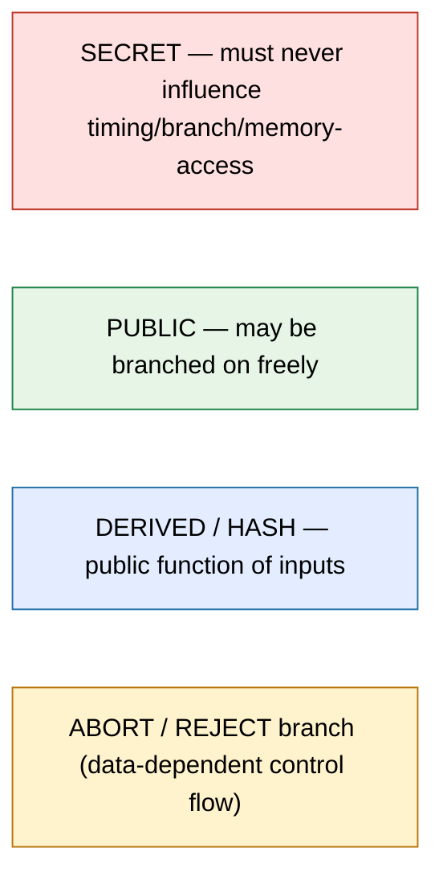

- **Red = secret.** The whole constant-time argument is: every operation on a red wire is straight-line
  and branchless (§5).
- **Green = public.** Anything an adversary already knows; branching on it is free.
- **Blue = derived/hash.** A deterministic public function (SHAKE, encode, NTT of a public value).
- **Amber = a data-dependent branch** — flagged explicitly so the residual control-flow surface is visible
  rather than hidden.

Each diagram is followed by **🔒 Security** (what makes the step sound) and **🛡 Side-channel** (how the step
avoids leaking), with pointers to the Go symbol and the proof artifact.

---

## 1. The shared base layer: the ring `R_q` and the NTT

Both schemes live in `R_q = Z_q[X]/(X²⁵⁶+1)`, `q = 8380417`, `n = 256`. All polynomial multiplication goes
through the **Number-Theoretic Transform** (NTT) — the single hottest operation, and therefore the focus of
both the optimization and the constant-time work.

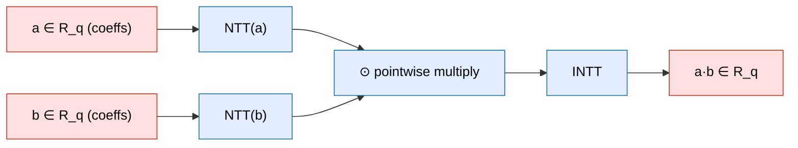

The NTT itself is a fixed network of **Cooley–Tukey butterflies** — the control flow (which indices pair
with which, the loop bounds, the twiddle schedule `ζ = 1753`) depends only on `n = 256`, **never on the
coefficient values**:

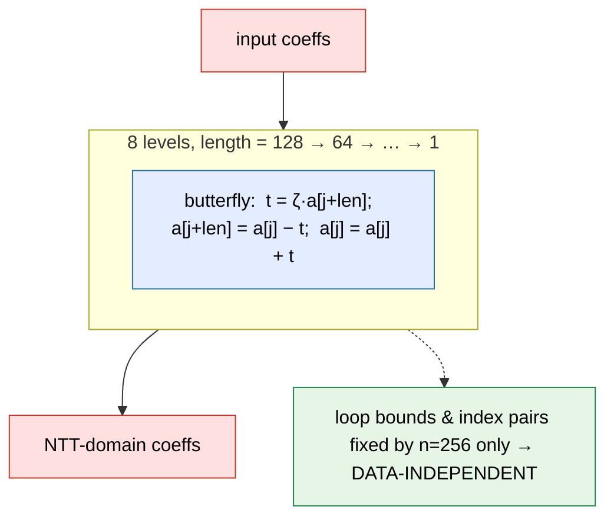

**🔒 Security.** The NTT is a *ring isomorphism* — multiplication via NTT is exact (`NTT(p·q)=NTT(p)⊙NTT(q)`,
`INTT∘NTT=id`). This is machine-checked from first principles (`ct_correct`, `ntt_tree_correct`,
`forest_loop_correct`, and the literal index arithmetic `jloop_eq`/`jloop_forest`), and the Montgomery
reduction constant `q·qinv ≡ 1 (mod 2³²)` is proved (`ml_adsa_montgomery.ec`). See `docs/31` and the paper §1.4.

**🛡 Side-channel.** The butterfly network is **straight-line with data-independent control flow** — this is
the property that makes the NTT constant-time, and it is **machine-backed** (`docs/34 §2a`). The reductions
inside the butterfly are branchless (`modQ` = `r + ((r>>63)&Q)`; the AVX2 kernel uses a Montgomery reduce
with a branchless `2³²−Q` correction, byte-identical to generic — `ntt_amd64.s`, `montgomery.go`). Go
symbols: `nttGeneric`/`inttGeneric` (`mldsa87.go`), `nttAVX2`/`inttAVX2` (`ntt_amd64.go`).

---

## 2. ML-DSA-87 (FIPS-204) end-to-end

### 2.1 KeyGen (Algorithm 1)

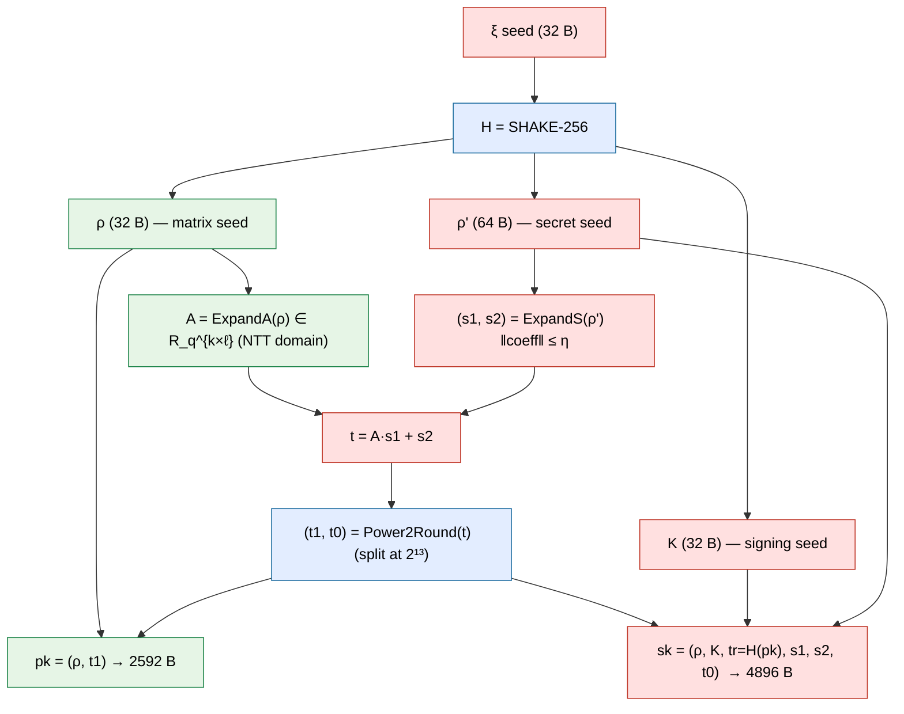

**🔒 Security.** `t = A·s1 + s2` is a **Module-LWE sample**: recovering `(s1,s2)` from `(A,t)` is the MLWE
problem at Category 5. `t1` (the published high bits) leaks nothing usable; `t0` is kept secret in `sk`.
Go: `KeyGenP` (`sign_param.go`). Assumption: decisional MLWE.

**🛡 Side-channel.** `s1,s2` are sampled by rejection from a SHAKE stream (`rejBoundedPolyP`); the *number*
of XOF reads can vary, but it is a function of the **public seed expansion**, not of any pre-existing
secret, and the sampled coefficients never steer a secret-dependent branch downstream. `A·s1+s2` is the
constant-time NTT path of §1.

### 2.2 Sign — Fiat–Shamir **with aborts** (Algorithm 7)

This is the only place with an intentional **data-dependent loop** (the rejection sampler). It is drawn
explicitly:

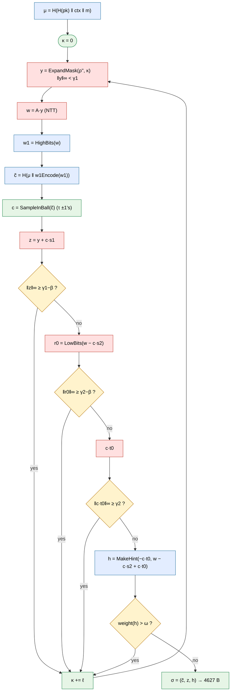

**🔒 Security.** The accepted `z = y + c·s1` is **perfectly masked**: conditioned on acceptance it is uniform
on its norm window, *independent of the secret shift `c·s1`*. This perfect-HVZK property is the heart of the
EUF-CMA proof and is now **machine-checked from first principles** — the rejection-sampling
change-of-variables `reject_uniform` / `masking_perfect_concrete` (`ml_adsa_masking.ec`), resting only on
`0 ≤ β ≤ γ1−1`. Go: `SignP` (`sign_param.go`).

**🛡 Side-channel.** The four amber checks (`‖z‖`, `‖r0‖`, `‖c·t0‖`, hint weight) **abort the attempt** — the
*number of attempts* is secret-dependent (inherent to FS-with-aborts). Two mitigations:
(1) the magnitude comparisons use the **branchless centered absolute value** `cabs` (a constant-time select,
not a data branch — `mldsa87.go`); (2) ML-ADSA's deployment uses **deterministic nonces** and a combiner
that **abstains on a *public* norm sum** (§3), so the loop-count surface is removed from the aggregate path.
The automated screen for this is the dudect Welch t-test harness (`ct_test.go`, `docs/34 §2c`).

### 2.3 Verify (Algorithm 8) — no secrets at all

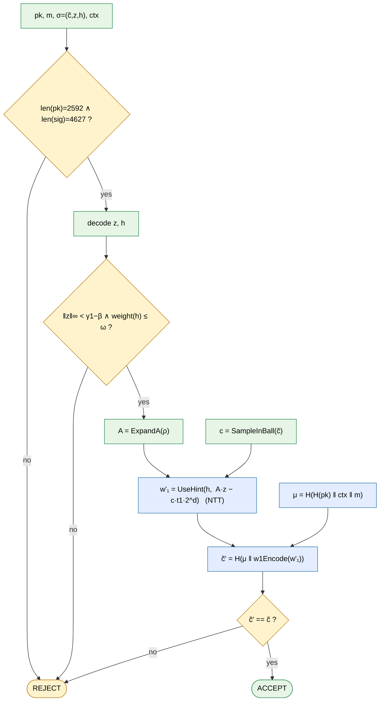

**🔒 Security.** Verify recomputes the challenge from `w'₁` and checks it matches `c̃`. A forgery requires a
SelfTargetMSIS solution. Go: `Verify` (`mldsa87.go`); the length/range guards (audit H1/H2/H3) make it
**panic-free on adversarial input** — important because in consensus a panic is a remote-DoS primitive.

**🛡 Side-channel.** Verify touches **no secret**, so all of its branches (amber) are on public data and are
free. The same code is the ML-ADSA verifier — the aggregate *is* a FIPS-204 signature.

---

## 3. ML-ADSA end-to-end

### 3.1 The one-line idea: the additive dual of BLS

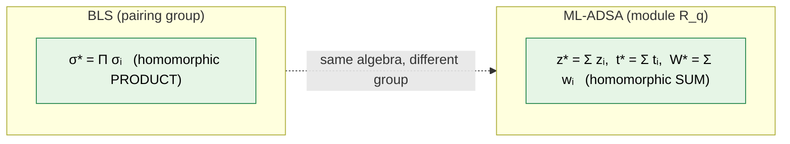

Aggregation is literally **addition in `R_q`**. The summed key `t* = Σ tᵢ` is itself a bona-fide ML-DSA key
(a sum of MLWE samples is an MLWE sample), and `z* = Σ zᵢ = (Σ yᵢ) + c̃*·(Σ s1ᵢ)` is the response of a single
signer holding that key — so `σ* = (c̃*, z*, h*)` verifies under the **unmodified** FIPS-204 verifier.

### 3.2 The non-interactive combine — no coordinator, no challenge sent, one broadcast per signer

> **This is _not_ an interactive (MuSig-style) handshake.** There is no aggregator that collects nonce
> commitments, replies with a challenge, and then gathers responses across rounds. Non-interactivity comes
> from three facts, and it is important to draw it that way:
>
> 1. **Deterministic nonces.** `y_i = DeriveNonce(msk_i, C)` — so each commitment `w_i = A·y_i` is fixed by
>    `(key_i, content C)` and is **pre-published** alongside `t_i` in the epoch key-tree / commitment pool,
>    in bulk, ahead of time. It is *not* a per-signature interactive "round 1."
> 2. **Self-derived challenge.** Every signer **computes `c*` itself** from the public cohort commitments
>    `{w_j}` (`c* = H(μ ‖ HighBits(W*))`). **Nobody sends a challenge.**
> 3. **Single broadcast.** Each signer therefore emits its response `z_i` as **one** message (exactly like a
>    BLS attestation gossip), and **any untrusted party just sums** `{t_j, w_j, z_j}` into `σ*`.

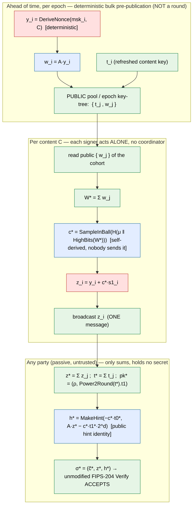

**On "two rounds."** There *is* a logical data dependency — `c*` depends on `W* = Σ w_j`, so commitments
must exist before responses (this is the Fiat–Shamir binding, and exactly why finished aggregates are
*homomorphic but not freely mergeable*). But that dependency is satisfied by **deterministic
pre-publication**, not by an interactive exchange: no signer waits on a message *from* another signer or
*from* a coordinator, and no challenge is ever transmitted. The earlier framing of this as an
aggregator-driven "round 1 / round 2" would describe the interactive MuSig design that ML-ADSA explicitly is
**not** (see [[ml-adsa-noninteractive]]).

**🔒 Security.** The self-derived `c*` binds the **entire** commitment `W*`, which is exactly what defeats the
Drijvers/ROS attack — giving concurrent security with **no ROS/AGM/OMDL assumption**
(`unbiasable_challenge`, `challenge_adversary_independent`; paper §6.4). Determinism + the public,
predictable content `C = (slot, committee)` also enforces the one-time discipline (fixed cohort ⇒ fixed `c*`
⇒ no nonce reuse). Go: the reference combine is `AggregateF` (`construction_f.go`) and the parameterized
`AggregateP` (`aggregate_param.go`); the per-node **decentralized** combine over public broadcasts is
`CombineFromPublic` (qrysm `mladsa/decentralized.go`), asserted byte-identical to `AggregateF` by
`TestDecentralized_EqualsAggregateF`.

**🛡 Side-channel.** The only secret-touching step is each signer's **local** `z_i = y_i + c*·s1_i` (the §2.2
constant-time path); the published `z_i` is HVZK-simulatable, so broadcasting it leaks nothing. The summing
party runs **entirely on public data** — `t_j, w_j, z_j` are public, and `rr2 = A·z* − c*·t1*·2^d` is the
public hint identity (computed *without* `s2*`). Its only branch — **ABSTAIN** when `‖z*‖∞ ≥ γ1−β` — is a
test on a **public sum**, so it leaks nothing and needs no resampling round.

### 3.3 The layered construction (L0–L3)

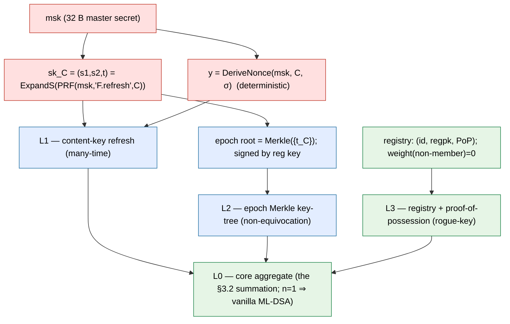

- **L1 (many-time).** Distinct contents `C` give independent keys (PRF security), so aggregating across many
  contents is safe and per-content security equals single ML-DSA (`ml_adsa_F_manytime.ec`,
  `ml_adsa_F_refresh.ec`). Nonces are **deterministic** — no per-signature RNG — subject to the **one-time
  discipline**: a `(signer, C)` signs at most once (enforced by `DurableOneTimeGuard`, fsync'd, write-ahead).
- **L2 (non-equivocation, properties F-C8/C9).** A `t_C` is accepted only if it is a proven member of a
  registration-signed epoch root. Go: `EpochKeyTreeBuild` + `(EpochKeyTree).PathFor` + `MerkleVerify`
  (`construction_f.go`, `merkle.go`), checked in aggregation by `ProvenanceVerifyF`; proofs: Coq
  `ml_adsa_F_provenance.v` and Gobra `merkleBinding`. ("VerifyEpochRoot"/"VerifyContentInTree" are the
  *prose* names for these checks in the spec, not Go symbols.)
- **L3 (rogue-key).** Recognized weight comes from the public registry + PoP; non-registered signers
  (decoys) have weight 0 and **cannot change outcomes** (`ml_adsa_rogue_proof.ec`, Coq
  `ml_adsa_F_decisions.v`, Gobra `filterRecognized`).

**🛡 Side-channel.** `msk` and the refreshed `sk_C`/nonce are the only long-lived secrets; they feed the
deterministic PRF (constant work) and then the §2.2 signer path. The one-time guard prevents the *one* fatal
leak of deterministic signing (two responses under the same nonce ⇒ key recovery) — see
[[deterministic-nonce-security]].

---

## 4. Security guarantees — the reduction chains

### 4.1 EUF-CMA (ROM keystone)

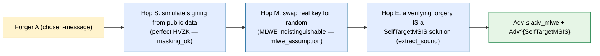

Machine-checked, admit-free: `msufcma_uncond` (`ml_adsa_euf.ec`). **SUF-CMA** adds the same-`(μ,c)`-new-`(z,h)`
collision term, bundled as `StrongSIS = SelfTargetMSIS ∨ Module-SIS` (`sufcma_uncond`, `ml_adsa_suf.ec`).

### 4.2 QROM (post-quantum) and equivalence-class hardness

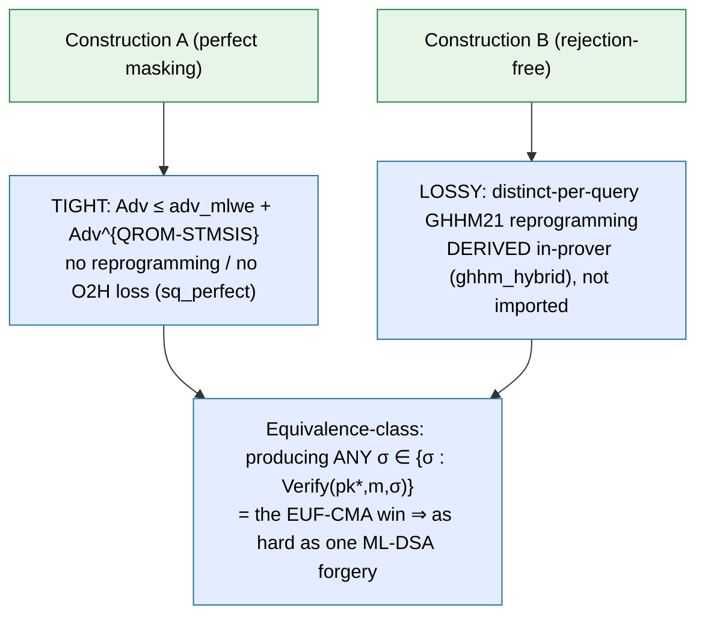

`qrom_eufcma_uncond` (A, tight), `qrom_eufcma_lossy` + `ml_adsa_qrom_ghhm.ec` (B, derived bound),
`equiv_class_guess_bound` / `qrom_equiv_class_uncond` (multiplicity gives no advantage). All inherit the
**parameter set's** NIST category — 2/3/5 for ML-ADSA-44/65/87 (the proofs quantify over `(k,ℓ,η,τ,γ,ω)`).

### 4.3 Which assumption guards which step

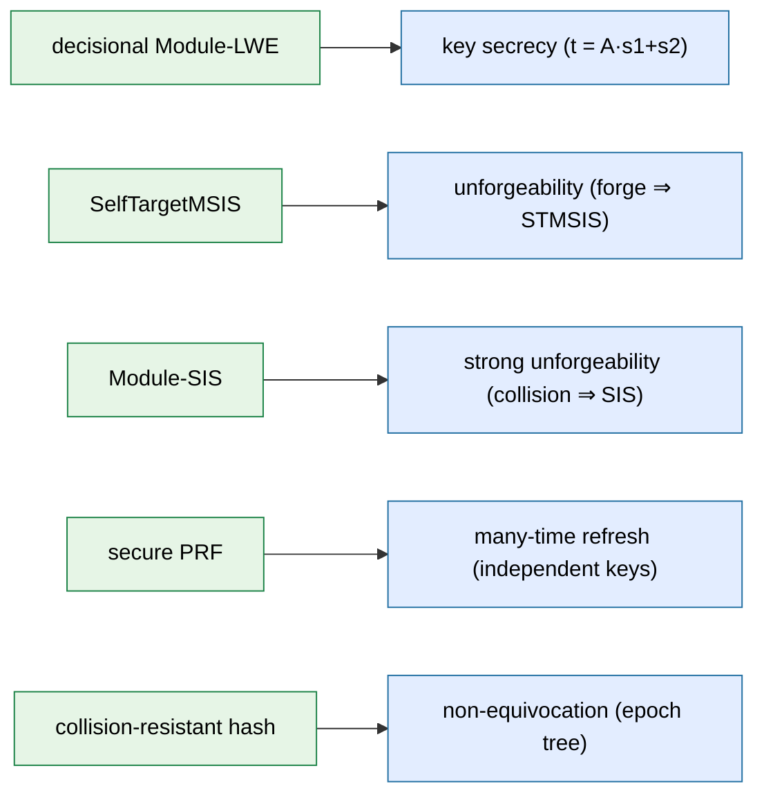

These are **exactly ML-DSA's own assumptions** — ML-ADSA adds no new hardness assumption.

---

## 5. Side-channel & leak-freedom — how it is guaranteed

The constant-time goal: **no secret value influences a branch, a memory-access pattern, or instruction
timing.** The posture and its evidence are in `docs/34 §2`; here is the picture.

### 5.1 The secret-data-flow map

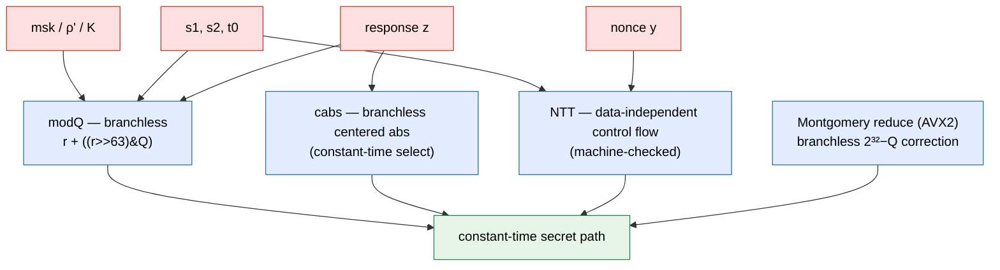

Every red→blue edge is an operation on a secret, and every blue node is **branchless / data-independent**.

### 5.2 Branchless reductions (the pattern, before → after)

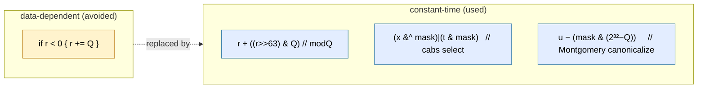

> Honest note: Go's compiler often lowers a naive `if r<0 { r+=Q }` to a branchless `cmov` anyway — which is
> *why* the dudect positive control had to use a data-dependent **loop count**, not a sign test, to register
> leakage (`ct_test.go`). The code uses the explicit branchless forms regardless, so the property does not
> depend on a compiler optimization (`docs/34 §2b`).

### 5.3 The NTT data-independence — as a proof obligation

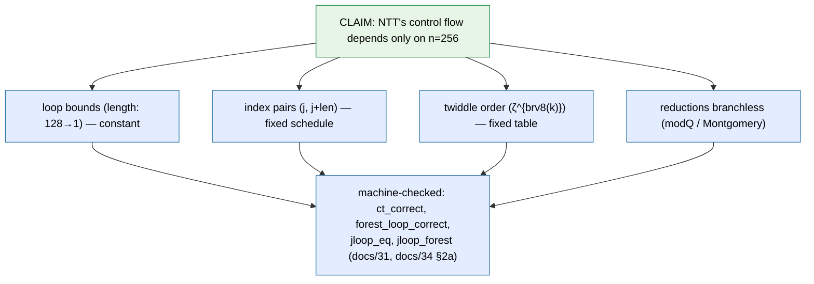

This is stronger than "we wrote it carefully": the iterative loop the code runs is *proved equal* to the
recursion, with termination, and the literal `a[j]`/`a[j+len]` index arithmetic is checked — so the
data-independence is a theorem, not a comment.

### 5.4 The validation pipeline (defense in depth)

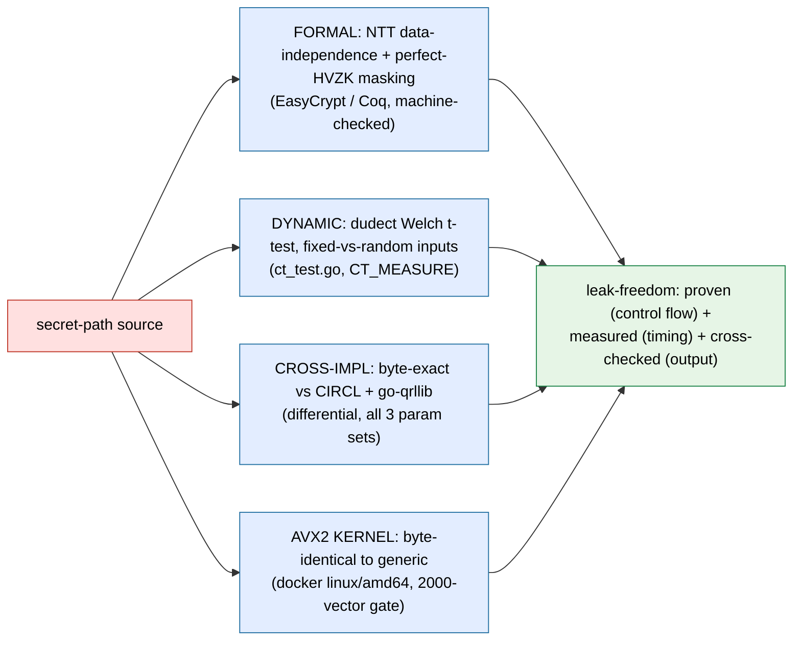

### 5.5 Constant-time checklist (decision view)

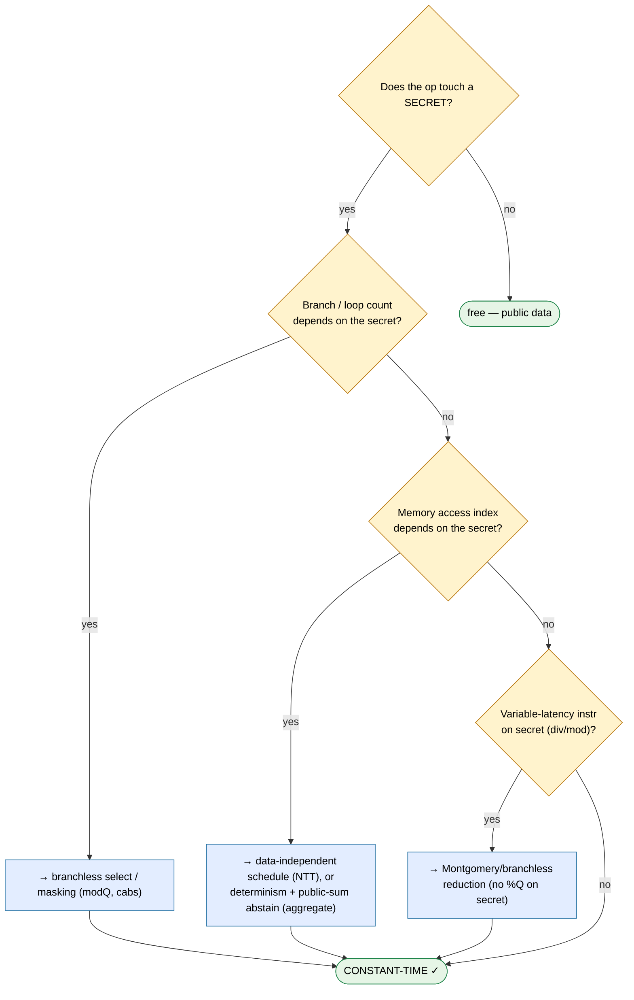

**Honest residual.** The one inherently data-dependent element is the **rejection-loop attempt count** in
single-signer signing (§2.2) — universal to Fiat–Shamir-with-aborts. ML-ADSA's deployment removes it from
the *aggregate* path (deterministic nonces + abstain on the *public* sum), and a fully hardened
single-signer build (constant-time sampler, masking) is the remaining engineering item (`docs/34 §2`,
`docs/32 #7`). Microarchitectural leakage on native silicon (`dudect`/`ctgrind` on x86) is a deployment-time
validation step, not yet run on hardware here.

---

## 6. Traceability and reproduction

Each diagram maps a step to its **Go symbol** and its **proof artifact**; the full row-by-row matrix is the
verification dossier (`docs/31`) and the implementation-conformance map (`docs/20`). Counts are the single
source of truth from `formal/count-artifacts.sh` (**36 artifacts / 244 lemmas / 50 genuineness / 6 Gobra**).

```
# regenerate the proof tallies these diagrams reference
cd formal && zsh count-artifacts.sh

# the constant-time evidence behind §5
cd go-mladsa && CT_MEASURE=1 go test -run TestConstantTime -v # dudect Welch t-test
cd go-mladsa && ./validate-avx2-docker.sh                    # AVX2 byte-identity (incl. NTT)
cd go-mladsa && go test -run 'TestCoreVsCIRCL|TestParamVerifyVsCIRCL'   # cross-impl differential
```

**Boundary (unchanged from the rest of the corpus).** The machine-checked proofs are about the
algorithm/model and the NTT's structure; the Go is byte-anchored to two independent FIPS-204 verifiers
(measurement). The diagrams visualize *both* surfaces and which is which — they do not assert a code-level
proof of the Go source beyond the Gobra structural theorems (`docs/22`).
